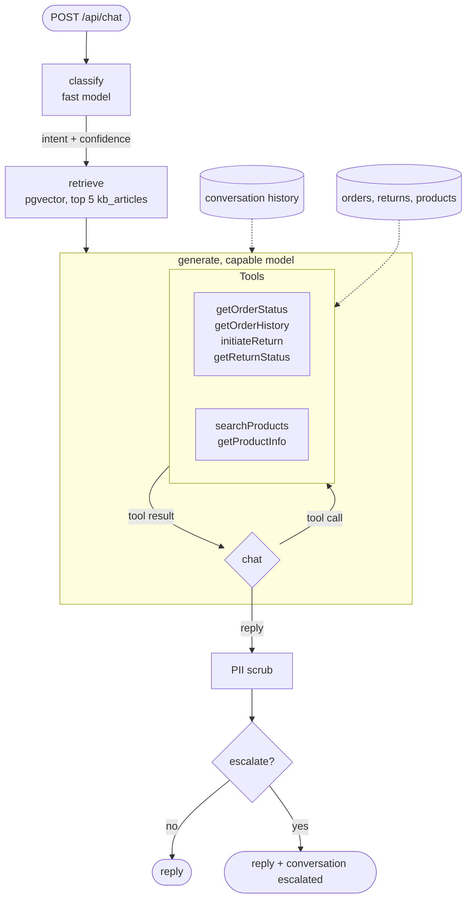

# AI Customer Support

> [Full Documentation](https://docs.base14.io/guides/ai-observability/spring-ai-llm-observability/)

Conversational AI customer support agent with RAG retrieval, tool calling, intent classification, escalation routing, and full OpenTelemetry observability.

Java 25, Spring Boot 4.0.7, Spring AI 2.0.0, WebFlux, pgvector, OTel Java agent 2.31.1.

## How to instrument Spring AI with OpenTelemetry

1. Add the `openai`, `anthropic` and `ollama` model starters and
   `spring-ai-starter-vector-store-pgvector` from `spring-ai-bom` 2.0.0, together with
   `spring-boot-starter-actuator`, `micrometer-tracing-bridge-otel` and `opentelemetry-api`,
   to `build.gradle`. The app ships no OTLP exporter and no OpenTelemetry SDK of its own.
2. Run under the OpenTelemetry Java agent. The `Dockerfile` downloads `opentelemetry-javaagent.jar`
   (2.31.1) and starts the app with `-javaagent:/app/opentelemetry-javaagent.jar`. The agent is the
   only exporter: `OpenTelemetryConfig` publishes `GlobalOpenTelemetry.get()` as the
   `OpenTelemetry` bean, so the Micrometer tracing bridge writes into the agent's tracer, and its
   `MeterRegistry` bean, built with the `opentelemetry-micrometer-1.5` bridge, writes meters into
   the same instance.
3. Set `OTEL_SERVICE_NAME=ai-customer-support`, `OTEL_EXPORTER_OTLP_ENDPOINT=http://localhost:4318`
   and `OTEL_SEMCONV_STABILITY_OPT_IN=gen_ai_latest_experimental` in `.env` (copied from
   `.env.example`). Prompt and completion capture stays off unless you set
   `OTEL_INSTRUMENTATION_GENAI_CAPTURE_MESSAGE_CONTENT=true`.

Spring AI's own chat, embedding and tool observations produce the GenAI spans. This example
replaces the default observation conventions so they emit `gen_ai.provider.name` instead of the
deprecated `gen_ai.system`, and adds a tracing observation handler that sets the attributes
Micrometer cannot type: `gen_ai.usage.input_tokens` and `gen_ai.usage.output_tokens` as integers,
`gen_ai.response.finish_reasons` as a string array, and `base14.gen_ai.cost_usd` as a double. On
top of that it adds `retrieval kb_articles` for pgvector search, evaluation events for the PII
filter and the escalation check, and `base14.support.*` metrics. The full guide is
[Spring AI OpenTelemetry Instrumentation](https://docs.base14.io/guides/ai-observability/spring-ai-llm-observability/).

## Architecture

Each `POST /api/chat` turn runs a five-stage pipeline. The generate stage is the agent: the
capable model can call order and product tools, and Spring AI runs the tool loop until the
model returns a reply.



- **classify** sorts the message into `QUERY`, `ACTION`, `COMPLAINT` or `ESCALATE` with a
  confidence score and extracted entities such as order IDs.
- **retrieve** embeds the message and pulls the five closest knowledge-base articles.
- **generate** builds a prompt from the intent, the articles and the conversation history.
  The model then calls tools to look up orders, start a return or search the catalogue.
  Each tool call gets an `execute_tool` span.
- **PII scrub** redacts emails, SSNs, card numbers and phone numbers from the reply
  before it is stored or returned.
- **route** escalates to a human when the customer asks for one, a complaint is
  classified with confidence below 0.6, any intent is below 0.5, or the conversation
  passes five turns. The decision is recorded as a `gen_ai.evaluation.result` event.

The pipeline has three layers of OTel: the Java agent (HTTP, database and Spring
auto-instrumentation), Spring AI's own observations (chat, embedding and tool calls through
Micrometer), and hand-written spans for the pipeline stages, retrieval and domain metrics.

## Quick Start

```bash
# Copy and configure environment
cp .env.example .env
# The defaults reach the host's Ollama through http://host.docker.internal:11434.
# For a hosted provider, set LLM_PROVIDER and the matching API key in .env and clear SPRING_PROFILES_ACTIVE.

# Start all services
docker compose up -d

# On a host without a local Ollama, start one alongside the stack on port 11434
# and set OLLAMA_BASE_URL=http://ollama:11434 in .env so the app reaches the container.
docker compose --profile ollama up -d

# Run smoke tests
./scripts/test-api.sh

# Send a message
curl -X POST http://localhost:8080/api/chat \
  -H "Content-Type: application/json" \
  -d '{"message":"What is the status of order ORD-10001?"}'
```

## API Endpoints

| Method | Path | Description |
| --- | --- | --- |
| `POST` | `/api/chat` | Send message, get JSON response with intent + content |
| `POST` | `/api/chat/stream` | Send message, get SSE streaming response |
| `GET` | `/api/conversations` | List all conversations |
| `GET` | `/api/conversations/{id}` | Get conversation with message history |
| `POST` | `/api/conversations/{id}/resolve` | Resolve a conversation |
| `GET` | `/api/products` | List all products |
| `GET` | `/api/products/{sku}` | Get product by SKU |
| `GET` | `/api/orders/{orderId}` | Get order by order ID |
| `GET` | `/api/health` | Health check |
| `GET` | `/api/failures` | List failure scenarios (failure-injection profile) |
| `POST` | `/api/failures/{scenario}` | Trigger failure scenario |

## Data

TechMart e-commerce store: 50 KB articles (10 categories), 30 products, 20 customers, 25 orders,
10 returns. KB articles are embedded into pgvector on first startup with the configured embedding
model (`embeddinggemma` on Ollama by default).

## Tool Calling

Spring AI `@Tool`-annotated methods available to the LLM:

| Tool | Description |
| --- | --- |
| `getOrderStatus` | Look up order status by order ID |
| `getOrderHistory` | Get customer's recent orders by email |
| `initiateReturn` | Start a return for a delivered order |
| `getReturnStatus` | Check return status by return ID |
| `searchProducts` | Search catalog by name/category |
| `getProductInfo` | Get product details by SKU |

## Observability

Every message produces a trace with:

- `support_conversation` - root pipeline span, carrying `gen_ai.conversation.id` and `gen_ai.agent.name`.
- `classify_intent` - intent classification stage.
- `chat {model}` - one CLIENT span per LLM call, from Spring AI's chat observation.
- `embeddings {model}` - one CLIENT span per embedding call, from Spring AI's embedding observation.
- `execute_tool {tool_name}` - one INTERNAL span per tool call, from Spring AI's tool observation.
- `retrieval kb_articles` - pgvector similarity search, with `gen_ai.data_source.id`.
- `generate_response` - response generation stage.
- `escalation_check` - escalation rule evaluation.

| Metric | Source | Instrument |
| --- | --- | --- |
| `gen_ai.client.token.usage` | Spring AI | Counter |
| `gen_ai.client.operation.duration` | This app | Histogram |
| `base14.gen_ai.cost` | This app | Counter |
| `base14.gen_ai.retry.count` | This app | Counter |
| `base14.gen_ai.fallback.count` | This app | Counter |
| `base14.gen_ai.error.count` | This app | Counter |

Spring AI records token usage as a counter rather than the histogram the GenAI conventions
describe. The framework instrument is kept, because adding a second one would count the
same tokens twice.

Domain metrics: `base14.support.conversation.turns`, `base14.support.conversation.duration`,
`base14.support.escalation.count`, `base14.support.tool_calls` and `base14.support.rag.similarity`.

Events: `gen_ai.evaluation.result` for the PII scan and the escalation check,
`tool_execution_failed` when a tool returns an error, `rag_retrieval_degraded` when retrieval
fails and the conversation continues, `tool_loop_limit_reached` when the tool loop stops at its
round limit, and `provider_fallback` when the primary provider is exhausted. Prompt and
completion text appears only in
`gen_ai.client.inference.operation.details`, and only when content capture is on. The same
setting adds `gen_ai.tool.call.arguments` and `gen_ai.tool.call.result` to each
`execute_tool` span. Both are PII-scrubbed and truncated like the message content.

### Three layers of OTel

1. **Java agent** (zero-code): HTTP server spans, JDBC and R2DBC database spans, Spring framework spans.
2. **Spring AI observations** (Micrometer): chat, embedding and tool-call spans, and token usage.
3. **Hand-written** (OTel API): pipeline stage spans, retrieval, evaluation events and domain metrics.

### Verify telemetry

```bash
./scripts/verify-scout.sh
```

## Development

Gradle 9.2 does not run on JDK 26, so every Gradle task runs in a container:

```bash
make lint     # Checkstyle over main and test sources
make build    # compile and package
make test     # run tests
make check    # lint, build and test
```

## LLM Providers

| Provider | `gen_ai.provider.name` | Models | Usage |
| --- | --- | --- | --- |
| Ollama | `ollama` | `qwen3.5:9B` (chat), `embeddinggemma` (embeddings) | Default primary and fallback |
| OpenAI | `openai` | `gpt-4.1` (capable), `gpt-4.1-mini` (fast) | `LLM_PROVIDER=openai` with `OPENAI_API_KEY` |
| Anthropic | `anthropic` | `claude-haiku-4-5-20251001` | `LLM_PROVIDER=anthropic` with `ANTHROPIC_API_KEY` |

`SPRING_PROFILES_ACTIVE` moves with `LLM_PROVIDER`. The shipped `ollama` profile excludes the
OpenAI and Anthropic autoconfigurations, so switching `LLM_PROVIDER` to a hosted provider means
clearing `SPRING_PROFILES_ACTIVE` as well; leaving the profile on fails at startup with
`ChatModel bean 'openAiChatModel' not found`.

Set `FALLBACK_PROVIDER` and `FALLBACK_MODEL` to route the retry-exhausted call to a second
provider. A fallback onto the provider and model the primary already used is skipped, so the
shipped Ollama default fails after its three attempts instead of six. `spring.ai.retry.max-attempts`
is set to `0` in `application.yml`, which turns off Spring AI's own RetryTemplate, so
`LlmService`'s three attempts and its fallback are the only retry path. Cost comes from
`_shared/pricing.json`, which the build copies onto the classpath; a model that is not in that
file costs 0.0.

## Failure Injection

Activate with Spring profile `failure-injection`, for example
`SPRING_PROFILES_ACTIVE=ollama,failure-injection`. 9 scenarios for testing observability under failure:

1. **hallucinated-order** - nonexistent order lookup.
2. **escalation-thrash** - angry customer triggering escalation.
3. **tool-loop** - ambiguous input causing repeated tool calls.
4. **rag-miss** - question outside KB coverage.
5. **rate-limit** - high-volume request.
6. **streaming-interrupt** - long response for SSE interruption.
7. **sensitive-data** - PII in input, verify redaction.
8. **context-overflow** - large conversation history.
9. **model-not-found** - the generate call asks for `no-such-model:latest`. Each attempt produces
   a `chat` span with status `Error` and the provider's error message. After three attempts the
   request falls back to `FALLBACK_MODEL` and succeeds, recording the retry, fallback and error
   metrics and a `provider_fallback` event. The fallback only runs when `FALLBACK_MODEL` is a model
   the provider has.

Trigger a scenario by name:

```bash
curl -X POST http://localhost:8080/api/failures/model-not-found
```

## Sample Conversations

- "What is the status of order ORD-10001?".
- "I want to return my headphones, order ORD-10005".
- "What products do you have in the audio category?".
- "I'm really frustrated, nothing is working. Let me talk to a human.".
- "What is your return policy?".
