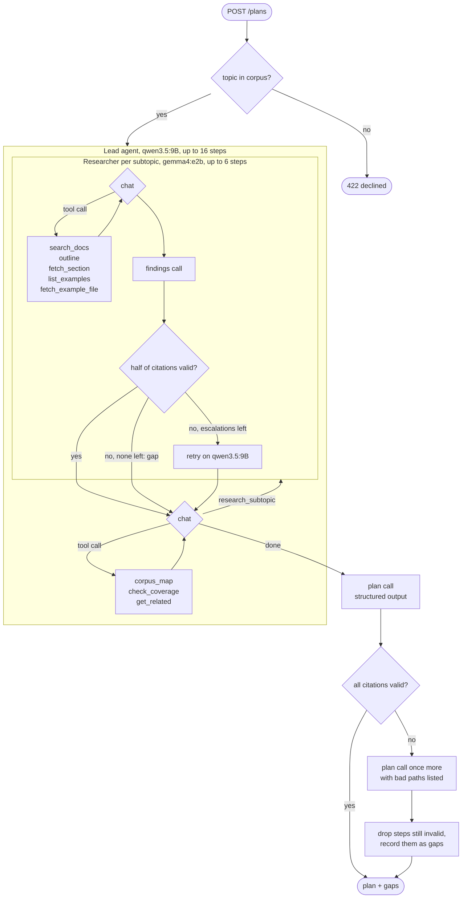

# AI Learning Path Planner

> [Full Documentation](https://docs.base14.io/guides/ai-observability/agent-observability/)

A Node.js service that turns a topic into a multi-week learning plan over base14's own documentation and examples
corpus. `POST /plans` runs a lead agent that breaks the topic into subtopics, calls one researcher subagent per
subtopic, and shapes what comes back into a plan whose every step cites a corpus path. OpenTelemetry records the
fan-out: one trace per request, a cost per run, and the token cost of the tool definitions each agent carries.

**Stack**: Node.js 26 · Hono 4 · Vercel AI SDK 7 or Mastra 1 · Ollama (local models) · OpenTelemetry · base14 Scout

One of the [Node.js examples](../README.md) in base14's [OpenTelemetry examples](../../README.md) repository. For a
single-agent Vercel AI SDK pipeline without the fan-out, read [ai-contract-analyzer](../ai-contract-analyzer). The
guides behind this example are
[AI Agent Observability](https://docs.base14.io/guides/ai-observability/agent-observability/) and
[Vercel AI SDK Instrumentation](https://docs.base14.io/instrument/apps/auto-instrumentation/vercel-ai-sdk/). The
Mastra variant is covered by
[Mastra Instrumentation](https://docs.base14.io/instrument/apps/auto-instrumentation/mastra/). Other links are under
[References](#references).

## How to instrument a Vercel AI SDK agent with OpenTelemetry

1. Install `ai`, `@ai-sdk/otel` and a provider package (`ollama-ai-provider-v2` here), plus
   `@opentelemetry/sdk-node`, `@opentelemetry/auto-instrumentations-node`, the OTLP trace, metric and log exporters,
   and `pino` for logs.
2. Load `src/telemetry.ts` with `node --import`, so the ESM loader hook is registered before anything imports
   `node:http`. It starts a `NodeSDK` with `ProviderNameSpanProcessor` and `PlanCostSpanProcessor` ahead of the
   exporting processor and a log record processor for the pino records, then calls
   `registerTelemetry` from `ai` with the `OpenTelemetry` implementation from `@ai-sdk/otel` to pick up the AI
   SDK's spans.
3. Hand that registration an `enrichSpan` hook, and pass `includeRuntimeContext` to every agent, so each AI SDK
   span carries the run's `gen_ai.conversation.id` and `base14.plan.id`, the agent's role and the active tool
   catalogue.
4. Add the `signal_to_metrics` connector in `config/otel-collector.yaml`, which derives
   `gen_ai.client.operation.duration` and `gen_ai.client.token.usage` from `chat` spans.
5. Set `OTEL_SERVICE_NAME`, `OTEL_EXPORTER_OTLP_ENDPOINT` and
   `OTEL_INSTRUMENTATION_GENAI_CAPTURE_MESSAGE_CONTENT` as `.env.example` and `compose.yaml` ship them.

The full guide is
[Vercel AI SDK OpenTelemetry Instrumentation](https://docs.base14.io/instrument/apps/auto-instrumentation/vercel-ai-sdk/).

## Prerequisites

- Node.js 26.8.2 and npm.
- Docker and Docker Compose.
- Ollama on the host, with both models pulled: `ollama pull qwen3.5:9B` and `ollama pull gemma4:e2b`.
- base14 Scout credentials, optional. Without them the collector keeps everything local and the example still
  runs end to end, `make verify` included; see [Scout export](#scout-export).
- Memory. The two models are about 13.5 GB together, and at the shipped `OLLAMA_NUM_CTX` of 16384 `qwen3.5:9B` is
  resident at roughly 5.9 GB. An 18 GB machine has room for it, 16 GB is tight and 8 GB is not enough.

No LLM provider key is needed. Ollama runs on the host and every model call goes to it.

## Quick start

```bash
cp .env.example .env
# Nothing in it has to be filled in. Fill in the four SCOUT_* variables only if you
# have a base14 tenant and want the telemetry exported to it.

ollama pull qwen3.5:9B
ollama pull gemma4:e2b

make docker-up
```

Ask for a plan. A planned run takes a couple of minutes and fans out to two to four subtopics, depending on the
topic and the machine. Open <http://localhost:3000> for a page that takes a topic and renders the plan, or call
the API directly.

```bash
curl -sN -X POST http://localhost:3000/plans \
  -H 'Content-Type: application/json' \
  -d '{"topic": "OpenTelemetry tracing for Node.js services"}'
```

The response is newline-delimited JSON, one object per line. The first line is written as soon as the request is
accepted; the second arrives when the run finishes.

```json
{"event":"accepted","id":"1c2d17e3-fd0c-465d-85f5-e60612553d4a","topic":"OpenTelemetry tracing for Node.js services"}
{"event":"plan","id":"1c2d17e3-fd0c-465d-85f5-e60612553d4a","status":"planned","plan":{"topic":"...","weeks":[...],"gaps":[...]}}
```

A run that fails part way through ends with an error line instead, carrying the same id. That id is what the run's
agent spans carry as `base14.plan.id`, so the trace is still findable:

```json
{"event":"error","id":"1c2d17e3-fd0c-465d-85f5-e60612553d4a","message":"..."}
```

`GET /plans/{id}` returns the same outcome, as `{status, plan}`, trimmed here to one week:

```json
{
  "status": "planned",
  "plan": {
    "topic": "OpenTelemetry tracing for Node.js services",
    "weeks": [
      {
        "subtopic": "Configuration Options and Environment Setup",
        "steps": [
          {
            "title": "Initialize NodeSDK and Configure traceExporter",
            "path": "docs/instrument/apps/auto-instrumentation/nodejs.md",
            "kind": "example",
            "why": "Key configuration points include initializing `NodeSDK` and configuring a `traceExporter`."
          }
        ]
      }
    ],
    "gaps": []
  }
}
```

To run the service on the host instead of in Compose, leave the collector up and start the app with
`npm install && npm run build && make start`. The collector still has to be running, because the app exports to it.
A host run needs no OTLP configuration: the SDK's default endpoint is `http://localhost:4318`, which is the port
`compose.yaml` publishes for the collector. Set `OTEL_EXPORTER_OTLP_ENDPOINT` only if you moved it.

## Endpoints

| Method | Path | Behaviour |
| --- | --- | --- |
| `GET` | `/` | A page that posts a topic to `/plans` and renders the streamed plan. |
| `POST` | `/plans` | Streams NDJSON and ends with the plan. 200 when the topic is in range, 422 when it is out of range, 400 when the body has no usable `topic`. |
| `GET` | `/plans/{id}` | `{status, plan}` for a completed run. 404 for an unknown id, and for every id after a restart. |
| `GET` | `/corpus/stats` | Document, section and heading counts, plus a document count per area. |
| `GET` | `/health` | Liveness. Filtered out of traces by the collector. |

A run ends in one of three statuses.

- `planned`. The lead researched at least one subtopic and the plan has at least one step.
- `declined`. The corpus has no coverage of the topic at all, so nothing was researched and no model was called.
  Answered 422. A declined run takes a few hundredths of a second and costs nothing.
- `failed`. One of four cases, and the gap reason says which. `service_error`: the run threw before the lead
  returned, usually because the model was unreachable. `no_tool_call`: the lead answered in prose and called no
  tool. `no_research`: the lead used its tools but researched no subtopic. None of those three: the lead
  researched, and the plan it shaped came back with no steps. Only `service_error` is an infrastructure failure,
  so the failure rate is not an infrastructure measure. See [Known gaps](#known-gaps).

## Configuration

Copy `.env.example` to `.env`. Every variable has a working default, the Scout credentials included: left empty
they turn the export off rather than stopping anything.

| Variable | Default | Notes |
| --- | --- | --- |
| `PORT` | `3000` | Host runs only. `compose.yaml` publishes 3000 and does not pass this through. |
| `LLM_PROVIDER` | `ollama` | `openai` and `anthropic` are code paths only. Neither is ever called here. |
| `OLLAMA_BASE_URL` | `http://localhost:11434/api` host, `http://host.docker.internal:11434/api` in Compose | Keep the `/api` suffix. Without it every model call 404s. |
| `OLLAMA_NUM_CTX` | `16384` | Sent as `providerOptions.ollama.options.num_ctx`. Ollama's own default of 4096 is overrun part way through a lead run. |
| `MODEL_SMALL` | `gemma4:e2b` | Researcher subagents. |
| `MODEL_LARGE` | `qwen3.5:9B` | The lead agent and escalation. |
| `PRICE_MODEL` | unset, resolved to `gpt-5-nano` | Price row borrowed for local token counts. See [Cost](#cost). |
| `PLANNER_FRAMEWORK` | `ai-sdk` | `mastra` runs the same agents on Mastra. See [Running on Mastra](#running-on-mastra). |
| `TOOL_CATALOGUE` | `deferred` | `full` sends all nine tools to both agents, for the measurement. |
| `MAX_SUBTOPICS` | `8` | Caps the fan-out. |
| `MAX_ESCALATIONS` | `2` | Caps escalations from the small tier to the large one, per run. |
| `ALLOW_HOSTED_PROVIDER` | unset | The service refuses to construct a hosted provider unless this is `true`. |
| `OTEL_INSTRUMENTATION_GENAI_CAPTURE_MESSAGE_CONTENT` | `false` | Prompts and completions off. Token counts are recorded either way. |
| `OTEL_SERVICE_NAME` | `ai-learning-path-planner` | `src/telemetry.ts` sets the same name in the resource, so a host run needs nothing. Set here it wins over that, which is how `compose.yaml` and the scripts name the service. |
| `OTEL_EXPORTER_OTLP_ENDPOINT` | `http://localhost:4318` | Where the app sends OTLP. `compose.yaml` fixes it to `http://otel-collector:4318`, which is the only name that resolves inside the network, so it is not interpolated from `.env`. A host run wants the default. |
| `OTEL_RESOURCE_ATTRIBUTES` | unset | `compose.yaml` sets `service.namespace=examples` plus the two environment keys from `SCOUT_ENVIRONMENT`. |
| `SCOUT_ENDPOINT`, `SCOUT_CLIENT_ID`, `SCOUT_CLIENT_SECRET`, `SCOUT_TOKEN_URL` | empty | Read by the collector, not by the app. Optional, and they go together. See [Scout export](#scout-export). |
| `SCOUT_ENVIRONMENT` | `development` | Set as `deployment.environment.name` and `environment` on every resource. |

## The corpus

The corpus is base14's own docs site and examples repository, indexed offline and shipped with the example as
`data/corpus.json.gz`. It is decompressed once at boot into an in-memory inverted index. There is no database, no
embedding step and no network call in the retrieval path.

What the shipped artifact holds, as `GET /corpus/stats` reports it:

| Area | Documents |
| --- | --- |
| `docs` | 271 |
| `collector-yaml` | 285 |
| `telemetry-source` | 113 |
| `example-readme` | 111 |
| `dockerfile` | 93 |
| **Total** | **873 documents, 10,787 sections, 10,719 headings** |

Rebuild it from local clones of the two repositories:

```bash
DOCS_REPO=/path/to/docs EXAMPLES_REPO=/path/to/examples make index
```

Inclusion is a set of filename and directory rules in `src/corpus/index-build.ts`, not a hand-picked list.
Application source that is not telemetry-related is excluded.

## Agent workflow

`POST /plans` runs a lead agent that fans out to researcher subagents, one per subtopic, and
then shapes their findings into a plan. Each agent runs a tool loop first and a separate
structured-output call after it.



- **Range check.** A topic the corpus never mentions is declined before any model call.
- **Lead loop.** The lead maps the corpus, checks coverage of candidate subtopics, and
  calls `research_subtopic` for each one, up to `MAX_SUBTOPICS`. Until it has researched
  something, every step must be a tool call.
- **Researcher loop.** Each researcher searches the docs and examples, reads outlines and
  sections, and returns findings that cite corpus paths. Only findings whose citations
  exist in the corpus are kept. If fewer than half pass, it runs again on the large model,
  up to `MAX_ESCALATIONS` per run. If confidence is still low or no escalations are left,
  the subtopic is recorded as a gap.
- **Plan call.** The lead turns the research notes into weeks of steps. Steps whose
  citations fail validation get one rewrite, then are dropped and listed as gaps.

## The agents and their tools

The lead agent runs on `qwen3.5:9B`, a researcher on `gemma4:e2b`. The two tool sets are disjoint, and on the
default `deferred` catalogue each role sees only its own.

| Tool | Role | What it does |
| --- | --- | --- |
| `corpus_map` | lead | Returns the areas of the corpus, how many documents each holds, and the overall counts. |
| `check_coverage` | lead | Reports whether a term is mentioned in a title, keyword, description or heading, with near misses. |
| `get_related` | lead | Returns corpus entries related to a known path, by keyword overlap and sidebar adjacency. |
| `research_subtopic` | lead | Runs one researcher subagent over one subtopic and returns its cited findings. |
| `search_docs` | researcher | Lexical search over the index. Returns paths, titles and areas by relevance. |
| `outline` | researcher | Returns a document's heading outline, before any of its text is paid for. |
| `fetch_section` | researcher | Returns the text of one section, by path and heading. |
| `list_examples` | researcher | Lists runnable examples whose metadata matches a topic. Caps at 20 hits. |
| `fetch_example_file` | researcher | Returns the full text of one file at any corpus path, an example file or a docs page. Caps at 24,000 characters. |

A researcher whose findings mostly fail citation validation escalates once to the large model, capped by
`MAX_ESCALATIONS`. If that fails as well, it returns a gap. Every citation in the finished plan is checked
against the index; a step that still cites a path the corpus does not have is dropped and recorded as a gap.

`search_docs`, `get_related` and `list_examples` return at most 20 entries, and `fetch_example_file` at most 24,000
characters. A capped result says so in the result itself, so the model knows it saw only part of the content.

Two properties of the loop:

- **The AI SDK enforces the tool requirement, not the provider.** While the lead has researched nothing, each step
  must call a tool. Ollama accepts `tool_choice` and ignores it in every request shape. The AI SDK checks the step
  client-side and throws `ToolChoiceViolationError`. `prepareStep` in `src/agents/lead.ts` sets `toolChoice` and
  adds an instruction that tells the model to call a tool.
- **The tool loop carries no response format.** A response format alongside tool definitions suppresses tool calls
  on this provider, so both the lead and the researchers run their loops unconstrained and shape their output in a
  separate call afterwards. That separate call is why there are two `invoke_agent` spans per agent.

## Telemetry

`src/telemetry.ts` is loaded with `node --import`, which registers the ESM loader hook before anything imports
`node:http`. The AI SDK's spans come from `@ai-sdk/otel` through `registerTelemetry`; HTTP and runtime spans come
from the Node auto-instrumentations.

The shape of one planned run, as the collector sees it:

```text
POST                                              server span, url.path=/plans
|-- invoke_agent qwen3.5:9B                       the lead's tool loop
|   |-- step 1
|   |   |-- chat qwen3.5:9B
|   |   `-- execute_tool corpus_map
|   |-- step 2
|   |   |-- chat qwen3.5:9B
|   |   `-- execute_tool research_subtopic
|   |       |-- invoke_agent gemma4:e2b           one researcher, one subtopic
|   |       |   `-- step 1
|   |       |       |-- chat gemma4:e2b
|   |       |       `-- execute_tool search_docs
|   |       `-- invoke_agent gemma4:e2b           the researcher's shaping call
|   |           `-- step 1
|   |               `-- chat gemma4:e2b
|   `-- step 3
|       `-- chat qwen3.5:9B
`-- invoke_agent qwen3.5:9B                       the lead's shaping call, writes the plan
    `-- step 1
        `-- chat qwen3.5:9B
```

Both agents show two `invoke_agent` spans, for the reason above: the loop and the shaping call are separate model
calls. One trimmed researcher is drawn; a real run has one such pair per subtopic. Each `chat` span also parents an
outgoing HTTP client span named `POST`, from the Node auto-instrumentations, which is elided here.

Span names are `invoke_agent <model id>`, `step <n>`, `chat <model id>` and `execute_tool <tool name>`. The HTTP
server span is named `POST`, since the instrumentation has no route to work from; assertions that need the path
read `url.path`. `gen_ai.agent.name` carries the telemetry `functionId`, not the agent id, so its four values are
`lead`, `lead-plan`, `researcher` and `researcher-findings`.

Concurrent researcher spans parent to the `execute_tool research_subtopic` span that started them. Their spans
overlap, but one Ollama instance serves the calls one at a time, so their durations add up. The example measures the
fan-out. The fan-out does not shorten a run.

### Attributes this example adds

The example's own attributes are under a `base14.` prefix, because semconv owns `gen_ai.*`. It also sets two
GenAI attributes: `gen_ai.conversation.id`, which `@ai-sdk/otel` never sets, and `gen_ai.provider.name`, which it
reports as the AI SDK provider id for Ollama.

| Attribute | On | Source |
| --- | --- | --- |
| `gen_ai.conversation.id` | Every AI SDK span in the run, equal to `base14.plan.id`. | Runtime context, read in `enrichSpan`. |
| `gen_ai.provider.name` | Rewritten from `ollama.responses` or `ollama.chat` to `ollama`. | `ProviderNameSpanProcessor` `onEnd`. |
| `base14.plan.id` | Every AI SDK span in the run: `invoke_agent`, `step`, `chat` and `execute_tool`. | Runtime context, read in `enrichSpan`. |
| `base14.agent.role` | `lead` or `researcher`. | Runtime context. |
| `base14.subtopic` | Researcher spans. | Runtime context, set per researcher agent. |
| `base14.tool.catalogue` | `deferred` or `full`. | Runtime context. |
| `base14.gen_ai.cost` | `chat` and `invoke_agent` spans. | Span processor `onEnd`, from the token counts. |
| `base14.gen_ai.cost.simulated` | The same spans. | True whenever the rate is borrowed for a local model. |

`enrichSpan` is an `@ai-sdk/otel` hook, so it reaches AI SDK spans and nothing else. The HTTP spans come from the
Node auto-instrumentations and carry no `base14.*`: not the server span for the request, and not the client spans
for the calls to Ollama. Filtering a trace store by `base14.plan.id` therefore returns the run's agent spans
without its root span, which is the one holding `url.path` and the status code. Filter by trace id to get the
whole trace.

Cost cannot come from `enrichSpan`, which fires when a span is created, before any token count exists.
`PlanCostSpanProcessor` reads the counts in `onEnd` and writes the cost onto the span, registered ahead of the
exporting processor so the exporter sees the attributes.

### Metrics

Six instruments, recorded at the end of every run, on all three outcomes. `base14.plan.gap.count` adds one point
per gap, so a run with no gaps adds none.

| Instrument | Type | Tags |
| --- | --- | --- |
| `base14.plan.cost` | histogram, USD | `catalogue`, `fanout_bucket`, `outcome` |
| `base14.plan.fanout` | histogram, subtopics | `outcome` |
| `base14.plan.duration` | histogram, seconds | `outcome` |
| `base14.plan.gap.count` | counter | `reason` |
| `base14.plan.escalation.count` | counter | `trigger` |
| `base14.gen_ai.tool_definition.tokens` | histogram, tokens | `role`, `catalogue` |

The cost, fan-out and duration bucket boundaries are set explicitly rather than left on the SDK defaults, which
start at 0 and jump to 5 and would put every measurement this service produces in one bucket.

`@ai-sdk/otel` records no metrics. The collector's `signal_to_metrics` connector derives the two GenAI client
metrics from `chat` spans, so a dashboard built on `gen_ai.client.*` has data:

| Metric | Type | Attributes |
| --- | --- | --- |
| `gen_ai.client.operation.duration` | histogram, seconds, from the span duration | `gen_ai.operation.name`, `gen_ai.provider.name`, `gen_ai.request.model`, `gen_ai.response.model` |
| `gen_ai.client.token.usage` | histogram, tokens, from `gen_ai.usage.input_tokens` and `gen_ai.usage.output_tokens` | The same, plus `gen_ai.token.type` |

Only `chat` spans count. `invoke_agent` spans carry the same tokens summed over the run, so counting both would
double them. The bucket boundaries are the ones the GenAI conventions advise. The connector emits delta
temporality.

`base14.gen_ai.tool_definition.tokens` is an estimate, not a token count. No tokeniser is available for a local
Ollama model, so the value is the serialised tool definitions' character count divided by four, with the `$schema`
URL dropped because the provider never receives it. State the divisor when you report the number.

### Logs

`@ai-sdk/otel` emits no logs. The service logs through `pino`, and the pino instrumentation in the Node
auto-instrumentations sends every record to the OpenTelemetry logs pipeline with the active trace and span id. A
run writes `plan accepted` and `plan finished` records, or `plan failed` with the error, each carrying `planId`.
`LOG_LEVEL` sets the level on a host run. The collector drops anything below info.

### Cost

A local model has no price row, so the service borrows one and marks the cost as simulated. With `PRICE_MODEL` unset
it uses `gpt-5-nano` at 0.05 and 0.40 USD per million input and output tokens: the cheapest input rate of the 79
non-zero rows in `_shared/pricing.json`, and the closest stand-in that table has for a small local model.

Which row is cheapest depends on the workload. This one is heavily input-weighted: tool definitions and accumulated
tool results are re-sent on every step, so a planned run spends roughly seventeen input tokens for every output
token. `gemini-2.0-flash-lite` at 0.075 and 0.30 is cheaper on the sum of the two rates, but overtakes `gpt-5-nano`
only below four input tokens to one output, which is not the ratio this service produces. Every cost computed this
way is simulated and carries `base14.gen_ai.cost.simulated=true` on the span.

On those rates a planned run costs a few thousandths of a dollar and a declined run costs nothing.

### Context window

`OLLAMA_NUM_CTX` is 16384, four times Ollama's own default of 4096, which a lead run overruns partway through. It is
the largest window that keeps `qwen3.5:9B` inside a 16 GB machine. Raise it if a run comes back "No output
generated", at the cost of VRAM.

## Deferred against the full tool catalogue

`TOOL_CATALOGUE` is the setting this example measures. On `deferred` each agent's model sees only its own tools, four
for the lead and five for the researcher. On `full` both see all nine. Tool definitions are re-sent on every step of
the loop, so the difference is paid once per model call.

```bash
make measure
```

It runs the same request under each setting and prints the difference. A representative pair:

|  | Deferred | Full | Difference |
| --- | --- | --- | --- |
| First model call, input tokens | 705 | 1080 | +375 |
| Tool definition estimate, lead | 290 | 650 | +360 |
| Tool definition estimate, researcher | 361 | 650 | +289 |
| Run cost, USD | 0.00257010 | 0.00273470 | not attributable |

Compare the two settings on the first-call figure, which is stable. Whole-run totals move with the model's step
count, which varies from run to run, so they cannot be attributed to the catalogue.

## Running on Mastra

Set `PLANNER_FRAMEWORK=mastra` to run the lead and the researchers on [Mastra](https://mastra.ai) agents. The
routes, tools, corpus, plan logic, metrics and logs are the same. Only the agent loop and its spans change. The full
guide is [Mastra OpenTelemetry Instrumentation](https://docs.base14.io/instrument/apps/auto-instrumentation/mastra/).

```bash
PLANNER_FRAMEWORK=mastra docker compose up -d --build
PLANNER_FRAMEWORK=mastra make test-api
PLANNER_FRAMEWORK=mastra make verify
```

- `src/agents/mastra.ts` builds the lead and the researchers as Mastra `Agent`s behind the interface
  `runLeadPlan` already takes. They use the same instructions, the same AI SDK tools and the same Ollama model
  objects.
- `src/telemetry/mastra.ts` creates one `Mastra` instance with `@mastra/otel-bridge`. The bridge creates Mastra's
  spans on the OpenTelemetry SDK that `src/telemetry.ts` starts, so they join the request's trace and pass
  through the same span processors and exporter. Mastra is loaded only in this mode.
- Mastra has no hook at span creation. The plan id, role and subtopic travel in the OpenTelemetry context, and
  `MastraPlanSpanProcessor` in `src/telemetry/plan-context.ts` writes them onto each Mastra span as the same
  `base14.*` and `gen_ai.conversation.id` attributes.
- Mastra passes a required tool choice to the provider and does not enforce it, so the lead checks for a prose
  answer itself and fails the run with the same `no_tool_call` gap.

What differs in the trace:

|  | AI SDK | Mastra |
| --- | --- | --- |
| Agent, model call and tool spans | `invoke_agent`, `chat`, `execute_tool` | the same names |
| Span per model step | `step`, under `invoke_agent` | `agent_step`, under `model_generation`, under `invoke_agent` |
| Extra spans | none | `model_chunk` under each `chat`, `processor_run` under each `agent_step` |
| Token usage and cost | on `chat` and on `invoke_agent` | on `chat` only |
| Status of a successful span | `Unset` | `Ok` |
| Instrumentation scope | `ai` | `@mastra/otel-bridge` |

Mastra records prompts, responses, tool arguments and results on its spans by default. With
`OTEL_INSTRUMENTATION_GENAI_CAPTURE_MESSAGE_CONTENT` unset, the agents pass `hideInput` and `hideOutput`, and
`MastraPlanSpanProcessor` removes the content attributes those two leave behind.

Mastra sends anonymous usage analytics to its maintainers unless `MASTRA_TELEMETRY_DISABLED` is set. The example
sets it to `1` when it is unset.

## Scout export

The export to base14 Scout is optional and off by default. The collector's configuration is two files:

- `config/otel-collector.yaml`, always loaded. Receive OTLP, filter the healthcheck spans, batch, print to the
  `debug` exporter. It needs no credentials and stands alone.
- `config/otel-collector-scout.yaml`, loaded only when `SCOUT_CLIENT_ID` is set. It adds the `oauth2client`
  extension, the `otlp_http/b14` exporter and the exporters list for each of the three pipelines. The traces list
  keeps `signal_to_metrics`, so the derived metrics reach Scout too.

`compose.yaml` does the selecting, in the collector's command line:

```yaml
command: --config=/etc/otel-collector.yaml ${SCOUT_CLIENT_ID:+--config=/etc/otel-collector-scout.yaml}
```

`${VAR:+...}` expands to nothing when the variable is empty or unset, so with no credentials the collector is
started with one `--config` and never loads the Scout half. With credentials it gets both, and the collector
deep-merges them: maps are joined and lists are replaced, so each pipeline keeps the receivers and processors from
the local file and gains the second exporter. The Scout file holds only the additions, so the span filter and the
pipelines are the same in both modes.

`.env.example` ships the four values empty and the stack runs that way. Fill all four in to export. Do not fill in
placeholders. A made-up value passes the collector's own validation, so the collector starts and reports healthy
while every export fails. The four go together, which is why none of them has a non-empty fallback in
`compose.yaml`: with `SCOUT_CLIENT_ID` set but the endpoint or the token URL empty, the collector stops at startup
rather than exporting somewhere wrong.

Every assertion in `make verify` reads the collector's `debug` exporter, which shows what the app produced before it
was exported, so the verification needs neither a Scout account nor a working export. With `SCOUT_CLIENT_ID`,
`SCOUT_CLIENT_SECRET` and `SCOUT_TOKEN_URL` set in the shell that runs it, the script prints a checklist for
verifying the hosted side by hand.

## Known gaps

In `@ai-sdk/otel` 1.0.123 with `ai` 7.0.123, checked 2026-09-30:

- **No metrics and no logs.** Durations and token counts are span attributes only. The collector derives the two
  GenAI client metrics, and the service's logs come from pino.
- **No `error.type`.** A failed call gets an error status and a recorded exception, plus
  `http.response.status_code` when the provider returned one.
- **No `server.address` or `server.port`** on `chat` spans. The child HTTP client span has them.
- **Provider names are mapped only for well-known providers.** Ollama arrives as `ollama.responses`; the example
  rewrites it.
- **No `gen_ai.conversation.id`.** The example sets it through `enrichSpan`.
- **Content capture is on by default.** `recordInputs` and `recordOutputs` default to `true`, and no
  `OTEL_*` variable is read. The example sets both from `OTEL_INSTRUMENTATION_GENAI_CAPTURE_MESSAGE_CONTENT`.
- **`OTEL_SEMCONV_STABILITY_OPT_IN` is not read.** The attribute names are fixed by the `@ai-sdk/otel` version.

The example's own gaps:

- **Retrieval is lexical.** An inverted index over titles, keywords, descriptions and headings, weighted in that
  order. No embeddings, no reranking. A subtopic phrased in words the corpus does not use will not be found.
- **Plans come only from the corpus.** The corpus is a fixed snapshot committed as `data/corpus.json.gz`, so a
  topic base14 has not documented produces a decline or a plan with gaps. The agents do not answer from general
  knowledge.
- **Cost on a local model is simulated.** The rates are borrowed from a hosted price row, as above. Every span of a
  local run carries `base14.gen_ai.cost.simulated=true`.
- **The plan store is in memory and bounded.** It holds 1024 completed runs and evicts the least recently
  completed, so a busy service loses the oldest ids. There is no persistence either, so every `GET /plans/{id}`
  returns 404 after the process restarts.
- **Plans are short.** One to five weeks and one to seven steps. Citations are checked and gaps are recorded, but
  `gemma4:e2b` returns few findings per subtopic.
- **A lead that never calls a tool is reported `failed`.** Roughly one run in ten ends this way, with a
  `no_tool_call` gap. There is no third outcome inside the loop, so a run that researched nothing is a failure
  rather than an empty plan. `scripts/verify-scout.sh` retries it up to three times and prints the attempt count.
- **The cost accumulator is bounded.** It holds 1024 runs and evicts the least recently updated. A run that goes
  silent across a full cap of other runs would have its cost truncated.
- **An empty `subtopic` is rejected after generation, not during it.** It surfaces as an `event: error` line and is
  recorded as `failed` rather than as a degraded plan.

## Development

```bash
npm install
npm run check          # typecheck, build, lint, 231 unit tests in 20 files
npm run test           # the unit tests alone
npm run test:api       # the endpoints, against a running service
make verify            # spans, attributes and the six instruments, against the collector
make measure           # deferred against full, on a live run
make docker-up         # the app and the collector
make docker-down
```

The unit tests need no model, no collector and no network. `npm run test:api` and `make verify` drive live runs, so
they need Ollama and the stack up, and they take several minutes.

## Troubleshooting

| Symptom | Cause and fix |
| --- | --- |
| The first model call fails saying the model is not found. | The models are not pulled. Run `ollama pull qwen3.5:9B` and `ollama pull gemma4:e2b`. |
| Every model call answers 404. | `OLLAMA_BASE_URL` is missing its `/api` suffix. The provider builds each URL as base plus `/chat`, so a base without `/api` posts to `/chat`. |
| The container cannot reach Ollama. | Ollama runs on the host, not in Compose. A container reaches it at `host.docker.internal`, which does not resolve on the host itself. Leave `OLLAMA_BASE_URL` empty in `.env` and let each side use its own default. |
| A run fails with "No output generated" and the model reports `done_reason: length`. | The context window was overrun. Raise `OLLAMA_NUM_CTX`, at the cost of VRAM. |
| The collector exits at startup with `no ClientID provided`, or with an empty endpoint. | `SCOUT_CLIENT_ID` is set but one of the other three is not, so the Scout config was loaded incomplete. Fill in all four, or clear `SCOUT_CLIENT_ID` to run without the export. |
| A run ends `failed` with a `no_tool_call` gap. | The lead answered in prose instead of calling a tool. About one run in ten. Retry it. |
| A run ends `failed` with a `service_error` gap. | The run threw before the lead returned, usually because the model was unreachable. Check Ollama, then `docker compose logs app`. |
| A run ends `failed` with a `no_research` gap, or with no gap of its own. | The lead used its tools but researched nothing, or it researched and the shaped plan had no steps. Not an infrastructure failure. Retry it. |
| `POST /plans` answers 422. | The topic is out of corpus range. Nothing was researched and no model was called. |
| `make verify` dies with `syntax error near unexpected token 'fi'`. | `scripts/verify-scout.sh` was edited while it was running. Bash reads the script incrementally. Let the run finish before editing it. |
| `make verify` reports a cost of zero. | The app is running with no `PRICE_MODEL` and no row of its own. The script normally restarts the app to set one; it warns when it cannot. |

## References

- [AI Agent Observability](https://docs.base14.io/guides/ai-observability/agent-observability/), for agent
  timelines, handoffs and tool calls.
- [Vercel AI SDK Instrumentation](https://docs.base14.io/instrument/apps/auto-instrumentation/vercel-ai-sdk/), for
  the SDK's own spans and metrics.
- [Mastra Instrumentation](https://docs.base14.io/instrument/apps/auto-instrumentation/mastra/), for the spans of
  the Mastra variant and its known gaps.
- [LLM Observability](https://docs.base14.io/guides/ai-observability/llm-observability/), for token, cost and
  latency signals.
- [Node.js Instrumentation](https://docs.base14.io/instrument/apps/auto-instrumentation/nodejs/), for the HTTP and
  runtime spans under the agent ones.
- [Collector Setup](https://docs.base14.io/category/opentelemetry-collector-setup), for pointing a collector at
  your Scout tenant.
- [OpenTelemetry GenAI semantic conventions](https://opentelemetry.io/docs/specs/semconv/gen-ai/).
- [Vercel AI SDK, agents and tool loops](https://sdk.vercel.ai/docs).
- [Mastra OtelBridge](https://mastra.ai/docs/observability/tracing/bridges/otel).

Other agent examples in this repository: [agent-rebooking](../../csharp/agent-rebooking) (C#, human approval gates
and MCP) and [ai-runbook-assistant](../../python/ai-runbook-assistant) (Python, LangChain callback handler against
zero-code auto-instrumentation).
