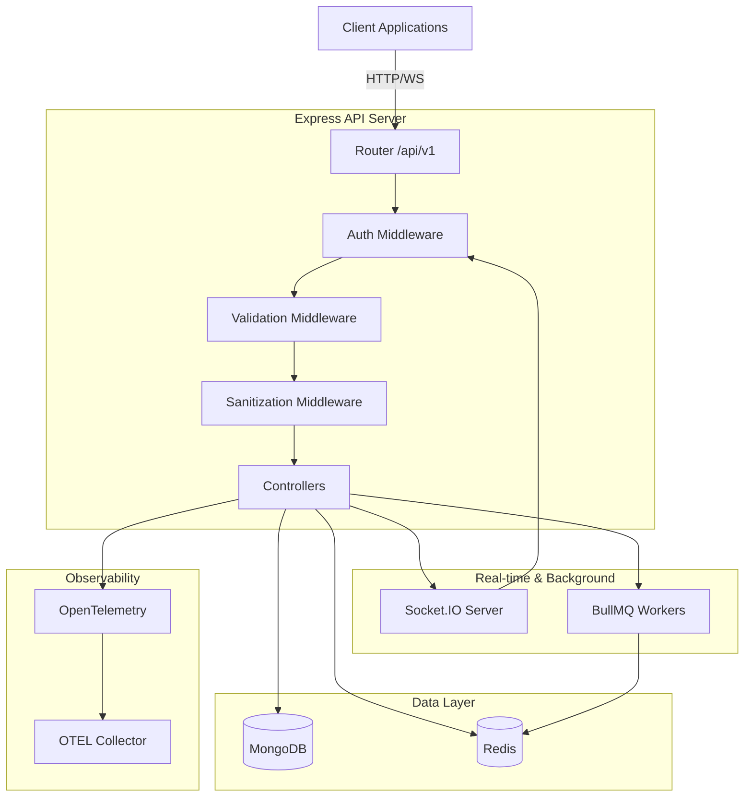
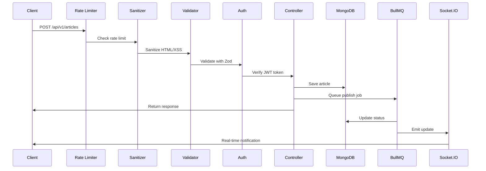

# Architecture Overview

## System Components

## Request Flow

## Technology Stack

| Component | Technology | Purpose |
| --------- | ---------- | ------- |
| **Runtime** | Node.js 20+ | Modern JavaScript runtime |
| **Framework** | Express 5 | HTTP server & routing |
| **Language** | TypeScript 5.7 | Type safety |
| **Database** | MongoDB + Mongoose | Document storage |
| **Cache** | Redis + ioredis | Session & job queue |
| **Jobs** | BullMQ | Background processing |
| **Real-time** | Socket.IO | WebSocket communication |
| **Validation** | Zod | Runtime type validation |
| **Security** | DOMPurify, Helmet | XSS protection, security headers |
| **Observability** | OpenTelemetry | Distributed tracing & logs |

## Security Layers

1. **Rate Limiting**: 100 req/15min (global), 5 req/15min (auth)
2. **Input Sanitization**: DOMPurify strips malicious HTML
3. **Validation**: Zod schemas validate all inputs
4. **Authentication**: JWT with runtime payload validation
5. **CORS**: Configured allowed origins
6. **Helmet**: Security headers (CSP, XSS, etc.)

## Key Design Decisions

### API Versioning

- Routes under `/api/v1/*` namespace
- Health check at `/api/health` (unversioned)
- Allows backwards-incompatible changes in future versions

### Validation Strategy

- Zod schemas provide both runtime validation and TypeScript types
- Middleware validates before controller execution
- Single source of truth for validation rules

### XSS Protection

- `content` field: Rich text allowed (p, strong, em, h1-h6, lists, links, images)
- All other fields: Strict sanitization (strips all HTML)
- Applied at middleware level before validation

### Graceful Shutdown

Shutdown order ensures data integrity:

1. Stop accepting new connections (HTTP server)
2. Close Socket.IO connections
3. Complete pending jobs (BullMQ)
4. Close Redis connection
5. Close MongoDB connection
6. Force exit after 10s timeout

## Scalability Considerations

- **Horizontal scaling**: Stateless API servers (session in Redis)
- **Background jobs**: BullMQ handles async operations
- **Real-time**: Socket.IO with Redis adapter for multi-server
- **Caching**: Redis reduces database load
- **Observability**: OpenTelemetry for monitoring distributed system
