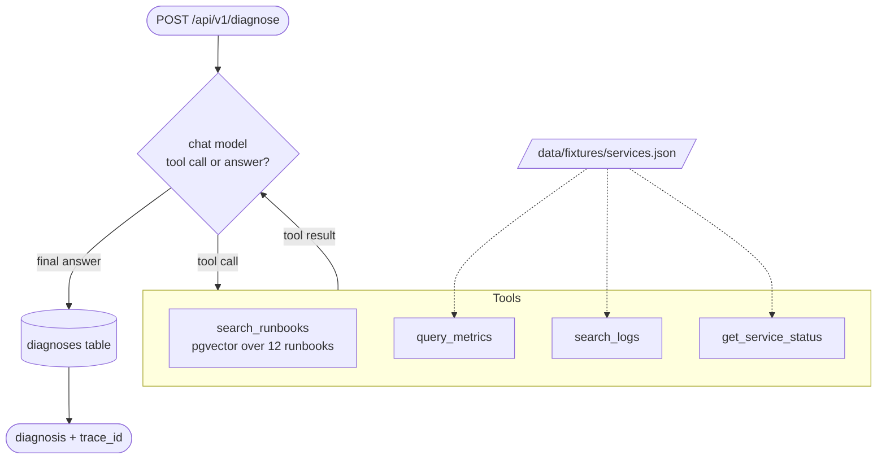

# AI Runbook Assistant

An SRE incident-diagnosis service built on a LangChain tool-calling agent (RAG over a
runbook corpus, plus fixture-backed metric, log, and status tools), instrumented end to
end with OpenTelemetry and viewable in [Base14 Scout](https://base14.io).

The focus is how you instrument LangChain with OpenTelemetry, and the trade-offs between
the two ways to do it.

## How to instrument LangChain with OpenTelemetry

1. Install `opentelemetry-api`, `opentelemetry-sdk`, `opentelemetry-exporter-otlp-proto-http`,
   `opentelemetry-instrumentation-fastapi`, `opentelemetry-instrumentation-sqlalchemy`,
   `opentelemetry-instrumentation-httpx`, `opentelemetry-instrumentation-logging` and
   `opentelemetry-instrumentation-langchain` (OpenLLMetry) from `pyproject.toml`.
2. Call `setup_telemetry(engine=engine)` from `src/runbook_assistant/telemetry/setup.py` in
   the FastAPI lifespan. It registers OTLP trace, metric and log exporters and the httpx,
   logging and SQLAlchemy instrumentors, then picks the LangChain mode from
   `INSTRUMENTATION_MODE`: `auto` calls `LangchainInstrumentor().instrument()`, `callback`
   passes an `OTelCallbackHandler` to the agent through `config={"callbacks": [...]}`.
   `instrument_fastapi(app)` then calls
   `FastAPIInstrumentor.instrument_app(app, excluded_urls="healthz,readyz")`.
3. Set `OTEL_SERVICE_NAME=ai-runbook-assistant`,
   `OTEL_EXPORTER_OTLP_ENDPOINT=http://otel-collector:4318`,
   `OTEL_SEMCONV_STABILITY_OPT_IN=gen_ai_latest_experimental` and
   `OTEL_INSTRUMENTATION_GENAI_CAPTURE_MESSAGE_CONTENT=false` as in `.env.example` and
   `compose.yaml`.

This example adds a hand-written callback handler emitting OTel GenAI semantic convention
spans, the `gen_ai.client.token.usage` and `gen_ai.client.operation.duration` histograms, the
`base14.gen_ai.cost`, `.retry.count`, `.fallback.count` and `.error.count` counters, OTLP logs
correlated with the active trace, and PII scrubbing of captured prompt content. The full guide is
[LangChain OpenTelemetry Instrumentation](https://docs.base14.io/instrument/apps/auto-instrumentation/langchain/).

## What you will learn

- How a LangChain callback handler maps onto OTel spans, metrics, and events, and why
  callbacks are where instrumentation hooks into any LangChain or LangGraph app.
- What zero-code auto-instrumentation captures, side by side with a hand-written handler
  over the identical request.
- How to keep an LLM trace joined to the rest of your stack, so the HTTP span, the agent,
  the tool calls, the vector search, and the database write all land in one trace.

The example ships both approaches behind one environment variable, so you can run the
same request through each and diff the output:

- **`auto`** - [OpenLLMetry](https://github.com/traceloop/openllmetry)
  (`opentelemetry-instrumentation-langchain`). One line at startup.
- **`callback`** - a hand-written `OTelCallbackHandler` emitting
  [OTel GenAI semantic conventions](https://github.com/open-telemetry/semantic-conventions/tree/main/docs/gen-ai).

OpenLLMetry is itself a callback handler, so the two differ in what they capture, not in
how they hook in.

## Stack

- Python 3.14, FastAPI, async SQLAlchemy 2.0.
- LangChain 1.x `create_agent` (LangGraph-backed).
- PostgreSQL 18 + pgvector for the runbook vector store.
- Ollama (`qwen3.5:9B` chat, `embeddinggemma` embeddings) by default, so no API key and
  no per-run cost. Anthropic, OpenAI, and Google are drop-in alternatives.
- Tenacity retries and a configurable fallback provider around every model call.
- OpenTelemetry SDK over OTLP/HTTP to an OpenTelemetry Collector, then to Scout.

## Prerequisites

- Docker with Compose.
- [uv](https://docs.astral.sh/uv/) for local development.
- [Ollama](https://ollama.com) on the host, with the models pulled:

  ```bash
  ollama pull qwen3.5:9B      # tool-capable chat model
  ollama pull embeddinggemma  # 768-dim embeddings
  ```

  Ollama stays on the host rather than in Compose to keep the image small and reuse your
  model cache. The container reaches it through `host.docker.internal`. If you would rather
  run it in Compose, start the bundled service with `docker compose --profile ollama up -d`
  and pull the two models inside that container.

## Quick start

```bash
cp .env.example .env
docker compose up -d --build
# wait for http://localhost:8000/healthz to return 200, then:
./scripts/test-api.sh
./scripts/verify-scout.sh
```

The collector exports to both Scout and a debug exporter. With the `SCOUT_*` values blank
the Scout export fails and is dropped, and everything still prints to the collector log, so
this works without credentials. Fill in `SCOUT_CLIENT_ID`, `SCOUT_CLIENT_SECRET`,
`SCOUT_TOKEN_URL` and `SCOUT_ENDPOINT` in `.env` to export for real.

`verify-scout.sh` drives a diagnosis and asserts against the collector output: span tree
shape, GenAI attributes, token and cost values, the in-trace database span, and the
resource attributes. Use it to confirm a change has not dropped a signal.

Switch modes and recreate to see the contrast:

```bash
INSTRUMENTATION_MODE=auto docker compose up -d --build
INSTRUMENTATION_MODE=auto ./scripts/verify-scout.sh
```

## Agent workflow

`POST /api/v1/diagnose` hands the incident question to one tool-calling agent built with
LangChain `create_agent`. The model decides which tool to call next, reads the result,
and repeats until it answers without a tool call. The system prompt tells it to start
with a runbook and then follow that runbook's diagnostic steps.



- **search_runbooks** embeds the question with `embeddinggemma` and returns the closest
  runbooks from pgvector, such as `container-oom` or `p99-latency`.
- **query_metrics**, **search_logs** and **get_service_status** return a metric value,
  matching log lines and replica or deploy status for a service. They read fixed data
  from `services.json`, so runs are repeatable.
- The final **chat** call writes the root cause and remediation and cites the runbooks it
  used. The answer is saved with the request's `trace_id`.

Every model call goes through the retry and fallback wrapper in `llm.py`.

## What gets instrumented

One `POST /api/v1/diagnose` produces a single trace spanning HTTP, agent, LLM, tools,
vector search, and the database write:

```text
POST /api/v1/diagnose                 (FastAPI HTTP span)
└─ invoke_agent runbook_assistant     (agent root)
   ├─ chat qwen3.5:9B                 (LLM: decide which tool to call)
   ├─ execute_tool search_runbooks
   │  └─ retrieval runbooks           (pgvector)
   │     └─ embeddings embeddinggemma (Ollama embedding call)
   ├─ execute_tool query_metrics
   ├─ execute_tool search_logs
   ├─ chat qwen3.5:9B                 (LLM: synthesize the diagnosis)
   └─ ...
   INSERT INTO diagnoses              (SQLAlchemy span, same trace)
```

The example emits all three signals:

| Signal | Source | What you get |
|---|---|---|
| Traces | `OTelCallbackHandler` + FastAPI, SQLAlchemy, HTTPX instrumentation | The tree above, with tokens and cost on every `chat` span |
| Metrics | `telemetry/metrics.py` | `gen_ai.client.token.usage`, `gen_ai.client.operation.duration`, `base14.gen_ai.cost`, `.retry.count`, `.fallback.count`, `.error.count` |
| Logs | `LoggerProvider` + `LoggingHandler` in `telemetry/setup.py` | OTLP log records carrying `trace_id` and `span_id`, so logs correlate with their trace |

The persisted `diagnoses` row also stores the `trace_id`, so a saved diagnosis links back
to the trace that produced it.

## How the callback handler works

LangChain emits lifecycle callbacks for every chain, model, tool, and retriever run, each
with a `run_id` and `parent_run_id`. Those parent pointers give you the span tree. The
handler keeps a `run_id -> span` map and starts each span in the parent's context.

See `src/runbook_assistant/telemetry/callback.py`:

| LangChain hook | Span | Kind | Key attributes |
|---|---|---|---|
| `on_chain_start` (outermost only) | `invoke_agent {agent}` | `INTERNAL` | `gen_ai.operation.name`, `gen_ai.agent.name`, `gen_ai.conversation.id` |
| `on_chat_model_start` / `on_llm_start` | `chat {model}` | `CLIENT` | `gen_ai.operation.name`, `gen_ai.provider.name`, `gen_ai.request.model`, `gen_ai.request.temperature`, `gen_ai.request.max_tokens` (all from LangChain's `ls_*` metadata), `server.address`, `server.port` |
| `on_llm_end` | closes `chat` | | `gen_ai.usage.input_tokens`, `output_tokens`, `base14.gen_ai.cost_usd`, `gen_ai.response.model`, `gen_ai.response.id`, `gen_ai.response.finish_reasons`, and one `gen_ai.client.inference.operation.details` event when capture is on |
| `on_tool_start` / `on_tool_end` | `execute_tool {name}` | `INTERNAL` | `gen_ai.tool.name`, `gen_ai.tool.type`, `gen_ai.tool.call.id` |
| `on_retriever_start` / `on_retriever_end` | `retrieval {source}` | `CLIENT` | `gen_ai.data_source.id`, `server.address`, `server.port`, retrieved chunk count |
| `on_*_error` | marks span `ERROR` | | Records the exception, sets `error.type`, sets status `ERROR`. `on_llm_error` also increments `base14.gen_ai.error.count`; `on_tool_error` adds a `tool_execution_failed` event to the parent span |

Embeddings have no LangChain callback, so `src/runbook_assistant/embeddings.py` wraps the
vector store's embedding client directly and emits the `embeddings {model}` span itself.

Three details that are easy to get wrong:

1. **Suppress intermediate chain spans.** LangGraph emits a chain callback per internal
   node. Instrumenting every one of them fills the trace with framework internals, so
   only the outermost chain becomes the agent root and inner nodes nest their children
   under it instead of creating spans of their own.
2. **Name spans `{operation} {target}`, not by class.** `chat qwen3.5:9B` is the semantic
   convention. `ChatOllama.chat` names the Python class, not the model that ran.
3. **Always end the span.** Every error hook closes its span with `StatusCode.ERROR`. A
   handler that only closes on success leaks spans on failed requests.

The handler is registered per request in `main.py` and passed through
`config={"callbacks": [...]}`, so it carries no cross-request state.

## Retry, fallback and errors

`src/runbook_assistant/llm.py` wraps the primary and fallback chat models in a
`ResilientChatModel`. A call retries three times with exponential backoff from 1 s to 10 s,
then switches to `FALLBACK_PROVIDER` / `FALLBACK_MODEL`. The trace holds one `chat` span
per provider attempt:

- A retry is invisible in the span tree. It increments `base14.gen_ai.retry.count` with
  `gen_ai.provider.name`, `error.type` and the attempt number.
- A provider switch closes the primary's span as `ERROR`, with the exception recorded and
  `error.type` set, and opens a second `chat` span beside it for the provider that
  answered, which carries that call's tokens and cost. The parent span gets a
  `provider_fallback` event and `gen_ai.fallback.triggered=true`, and
  `base14.gen_ai.fallback.count` and `base14.gen_ai.error.count` both increment. The
  parent span is not marked failed, because the request succeeded.
- A call that fails outright marks its span `ERROR` with the exception recorded and
  `error.type` set, and increments `base14.gen_ai.error.count`.

On the HTTP edge, `src/runbook_assistant/errors.py` registers an exception handler that
records an unhandled error on the active span and returns a 500, and a middleware that
marks the server span `ERROR` for any response of 400 or above.

## Instrumentation modes

Set `INSTRUMENTATION_MODE`:

- `callback` (default) - registers `OTelCallbackHandler` per request.
  See `src/runbook_assistant/telemetry/callback.py`.
- `auto` - calls `LangchainInstrumentor().instrument()` once at startup.
  See `src/runbook_assistant/telemetry/auto.py`.
- `off` - no LangChain instrumentation. FastAPI, SQLAlchemy, and HTTPX spans still emit.

### Auto vs custom, same request

Captured from the same question (*"disk usage on node-7 is at 95 percent"*) against
Ollama `qwen3.5:9B`:

| | `callback` (custom handler) | `auto` (OpenLLMetry) |
|---|---|---|
| Code required | the handler (~300 lines) | one line at startup |
| LLM span name | `chat qwen3.5:9B` (semconv `chat {model}`) | `ChatOllama.chat` (class-based) |
| `gen_ai.request.model` | `qwen3.5:9B` | `unknown` |
| Agent span | `invoke_agent runbook_assistant` (your app) | `invoke_agent LangGraph` (the framework) |
| Retrieval span | `retrieval runbooks` | `vector_db_retrieve VectorStoreRetriever` |
| Message shape | flat `{"role","content"}` | nested `{"role","parts":[{"type","content"}]}` |
| Tool calls in output | text only | structured `tool_call` parts with `arguments` |
| Tool schemas | not captured | `gen_ai.tool.definitions` (full JSON schema) |
| Content capture | off by default (`OTEL_..._CAPTURE_MESSAGE_CONTENT`) | on by default (`TRACELOOP_TRACE_CONTENT`) |
| Extra attributes | `gen_ai.*` only | `gen_ai.*` plus `traceloop.*` and `gen_ai.workflow.*`/`task.*` |

Both emit content under the same semconv keys, `gen_ai.input.messages` and
`gen_ai.output.messages`. The message *shape* differs. The custom handler writes a flat
`content` string; OpenLLMetry writes a `parts` array and captures tool calls, tool
schemas, and LangGraph internals the custom handler leaves out:

```jsonc
// callback - flat text
[{"role": "assistant", "content": "The runbook for high disk usage suggests ..."}]

// auto - structured parts, tool call captured
[{"role": "assistant", "parts": [{"type": "tool_call", "name": "search_runbooks",
  "arguments": {"query": "high disk usage remediation"}}], "finish_reason": "..."}]
```

Use `auto` when you want coverage for zero code and accept class-based span names,
`model = unknown` in cost and usage queries, content on by default, and a vendor
attribute namespace alongside `gen_ai.*`.

Use a handler when span names and attributes feed dashboards, alerts, or chargeback and
need to be stable, semconv-compliant, and correct about which model ran. You write and
maintain the handler, and you capture only what you instrument. Completions and tool-call
arguments are explicit code here.

A middle path: start on `auto` for immediate coverage, then move to a handler for the
paths that feed alerts.

## GenAI semantic conventions

- Spans are named `{operation} {target}`: `invoke_agent`, `chat`, `execute_tool`,
  `retrieval`, `embeddings`. No `gen_ai.` prefix on the operation inside the span name.
- Metrics: `gen_ai.client.token.usage` (histogram, split by `gen_ai.token.type`) and
  `gen_ai.client.operation.duration` (histogram, seconds) keep their semconv names.
  Everything the conventions do not define carries a `base14.` prefix:
  `base14.gen_ai.cost` (counter, USD), `base14.gen_ai.retry.count`,
  `base14.gen_ai.fallback.count` and `base14.gen_ai.error.count`.
- Cost is computed locally in `src/runbook_assistant/cost.py` from `_shared/pricing.json`
  and attached as `base14.gen_ai.cost_usd`. Compose mounts `_shared/` read-only into the
  container. Unknown models, Ollama included, cost 0.
- `LLM_PROVIDER=google` selects Gemini, matching the gateway contract's provider key. The
  emitted `gen_ai.provider.name` is `gcp.gemini`, which is the semantic convention value.
- Resource carries the dual-key environment: `deployment.environment.name` plus
  lowercase `environment`, which is what Scout filters on. Set on the resource and
  upserted by the collector.
- `OTEL_SEMCONV_STABILITY_OPT_IN=gen_ai_latest_experimental` opts the OTel instrumentation
  libraries into current GenAI conventions.

Companion guide:
[LangChain auto-instrumentation](https://docs.base14.io/instrument/apps/auto-instrumentation/langchain).

## Prompt and completion capture

Content capture is **off by default** in `callback` mode. Prompts and completions often
carry incident detail, hostnames, and customer identifiers, and once exported they follow
your telemetry backend's retention and access rules.

Enable with `OTEL_INSTRUMENTATION_GENAI_CAPTURE_MESSAGE_CONTENT=true`. One
`gen_ai.client.inference.operation.details` event is then added per call, carrying
`gen_ai.input.messages` (1000 chars), `gen_ai.output.messages` (2000) and
`gen_ai.system_instructions` (500, omitted when the system prompt is empty). All three are
PII-scrubbed by `src/runbook_assistant/pii.py` (emails, IPv4, bearer tokens, API keys).
Tool-call turns with no text emit no output message.

In `auto` mode content is on by default. Disable it with `TRACELOOP_TRACE_CONTENT=false`.

The scrubber is a backstop, not a compliance control. Decide what may leave your boundary
before enabling capture in production.

## Configuration

| Variable | Default | Purpose |
|---|---|---|
| `INSTRUMENTATION_MODE` | `callback` | `callback`, `auto`, or `off` |
| `LLM_PROVIDER` | `ollama` | `ollama`, `anthropic`, `openai`, `google` |
| `LLM_MODEL` | `qwen3.5:9B` | Must be tool-capable |
| `FALLBACK_PROVIDER` | `ollama` | Used after the primary exhausts its retries |
| `FALLBACK_MODEL` | `qwen3.5:9B` | Model for the fallback provider |
| `OLLAMA_BASE_URL` | `http://host.docker.internal:11434` | `http://localhost:11434` when running the app directly on the host |
| `ANTHROPIC_API_KEY` / `OPENAI_API_KEY` / `GOOGLE_API_KEY` | empty | Required only for that provider |
| `EMBEDDING_MODEL` | `embeddinggemma` | Vector store embeddings, 768-dim |
| `DATABASE_URL` | local Postgres | pgvector-enabled PostgreSQL |
| `OTEL_ENABLED` | `true` | Set `false` to disable telemetry entirely |
| `OTEL_SERVICE_NAME` | `ai-runbook-assistant` | Becomes `service.name` |
| `OTEL_EXPORTER_OTLP_ENDPOINT` | `http://localhost:4318` | OTLP/HTTP collector endpoint |
| `SCOUT_ENVIRONMENT` | empty | Written to both environment resource keys |
| `OTEL_INSTRUMENTATION_GENAI_CAPTURE_MESSAGE_CONTENT` | `false` | Prompt and completion capture |
| `SCOUT_CLIENT_ID` / `SCOUT_CLIENT_SECRET` / `SCOUT_TOKEN_URL` / `SCOUT_ENDPOINT` | empty | Collector to Scout OAuth, leave blank for local runs |

## API

| Method | Path | Body | Response |
|---|---|---|---|
| `POST` | `/api/v1/diagnose` | `{"question": "..."}` | `{"answer": "...", "diagnosis_id": "..."}` |
| `GET` | `/healthz` | - | `{"status": "ok"}` |
| `GET` | `/readyz` | - | `{"status": "ready"}` |

```bash
curl -X POST http://localhost:8000/api/v1/diagnose \
  -H 'content-type: application/json' \
  -d '{"question": "checkout pods are being OOMKilled, what do I do?"}'
```

Health endpoints are excluded from HTTP tracing, so probe traffic produces no spans.

## Viewing telemetry in Scout

With `SCOUT_*` set, open Scout and look at:

- A diagnosis trace: `invoke_agent` to `chat`, `execute_tool`, `retrieval` and
  `embeddings`, with the `diagnoses` INSERT span in the same trace.
- Tokens and cost per `chat` span, and the `gen_ai.client.*` and `base14.gen_ai.*` metrics
  over time.
- Logs filtered by `trace_id` to sit alongside the request that emitted them.

Two dashboards ship under `dashboards/`, with the panel-by-panel rationale in
`dashboards/DESIGN.md`:

- `operational.json` - token throughput, cost rate, tool and retrieval activity, errors,
  retries and fallbacks.
- `strategic.json` - cost and usage trends by model and provider.

## Project layout

```text
src/runbook_assistant/
├── telemetry/
│   ├── setup.py         # providers, OTLP exporters, resource, base instrumentation
│   ├── callback.py      # the LangChain -> OTel callback handler
│   ├── auto.py          # OpenLLMetry one-liner
│   └── metrics.py       # gen_ai.client.* instruments
├── agent.py             # create_agent, system prompt, invocation
├── llm.py               # chat model factory, retry and provider fallback
├── providers.py         # provider semconv names and server endpoints
├── embeddings.py        # instrumented embedding client
├── tools.py             # search_runbooks, query_metrics, search_logs, get_service_status
├── retriever.py         # pgvector store + runbook seeding
├── cost.py              # token -> USD from _shared/pricing.json
├── pii.py               # scrubbing for opt-in content capture
├── errors.py            # exception handler + HTTP span status
├── db.py                # async SQLAlchemy, diagnoses table
└── main.py              # FastAPI app, per-request handler wiring
```

Reading order for the instrumentation: `setup.py`, then `callback.py`, then `metrics.py`.

## Testing

```bash
uv sync --extra dev
uv run pytest -m "not integration"   # unit tests, no external services
uv run pytest -m integration         # needs Docker (pgvector) and Ollama
make check                           # ruff + mypy --strict + unit tests
```

The telemetry tests assert on exported spans through an in-memory exporter, so span
names, attributes, and parenting are covered without a running collector. This catches
instrumentation regressions in CI rather than in a dashboard.

## Troubleshooting

**No spans in the collector.** Confirm `OTEL_EXPORTER_OTLP_ENDPOINT` points at the
collector's OTLP/HTTP port (`4318`, not `4317`) and includes no path. The exporters
append `/v1/traces`, `/v1/metrics`, and `/v1/logs` themselves. Check `OTEL_ENABLED`.

**Spans arrive but no `chat` spans.** You are likely in `off` mode, or in `callback` mode
with the handler not reaching the agent. The handler is passed per request through
`config={"callbacks": [...]}`; a call path that bypasses that produces no LLM spans.

**`gen_ai.request.model` is `unknown`.** Expected in `auto` mode. OpenLLMetry does not
resolve the model name for every provider. This is the main reason to prefer the handler
when you query or alert on model.

**Tool calls never happen.** The model must support tool calling. Smaller local models
often accept the request and answer without calling a tool. Stay on a tool-capable model
such as `qwen3.5:9B`.

**Ollama connection refused from the container.** Use
`OLLAMA_BASE_URL=http://host.docker.internal:11434`. Inside the container, `localhost` is
the container itself.

**Cost is always 0.** The model is not a key in `_shared/pricing.json`, which is expected
for Ollama. Local inference has no per-token price.

**Collector cannot authenticate to Scout.** All four `SCOUT_*` values must be set for the
OAuth extension in `otel-collector-config.yaml`. The collector log names the missing or
rejected credential.

## Adapting this to your own LangChain app

1. Copy `telemetry/setup.py` and adjust the resource attributes and OTLP endpoint.
2. Copy `telemetry/callback.py`. The hook-to-span mapping is framework-agnostic within
   LangChain, so what changes is your agent name, data source id, and which attributes
   matter to you.
3. Register the handler per request rather than globally, so requests stay isolated.
4. Keep content capture behind an environment variable, off by default.
5. Add span assertions to your test suite using an in-memory exporter, so a refactor that
   drops an attribute fails CI.

## References

- [OTel GenAI semantic conventions](https://github.com/open-telemetry/semantic-conventions/tree/main/docs/gen-ai)
- [LangChain callbacks](https://python.langchain.com/docs/concepts/callbacks/)
- [OpenLLMetry](https://github.com/traceloop/openllmetry)
- [Base14 Scout docs](https://docs.base14.io)
