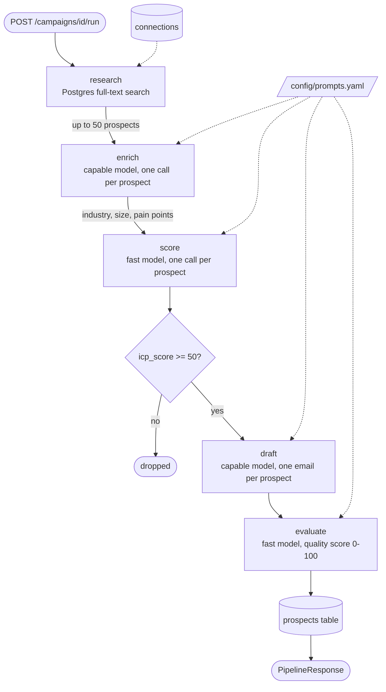

# AI Sales Intelligence

> [Full Documentation](https://docs.base14.io/guides/ai-observability/llm-observability/)

AI-powered sales intelligence agent demonstrating **unified observability** for AI applications using OpenTelemetry and Base14 Scout.

## How to instrument LangGraph with OpenTelemetry

1. Install `opentelemetry-api`, `opentelemetry-sdk`, `opentelemetry-exporter-otlp-proto-http`,
   `opentelemetry-instrumentation-fastapi`, `opentelemetry-instrumentation-sqlalchemy`,
   `opentelemetry-instrumentation-httpx` and `opentelemetry-instrumentation-logging` from
   `pyproject.toml`. No LangGraph-specific instrumentation package is used.
2. Call `setup_telemetry(engine)` from `src/sales_intelligence/telemetry.py` before creating
   the FastAPI app. It registers OTLP trace and metric exporters and calls
   `HTTPXClientInstrumentor().instrument()`, `LoggingInstrumentor().instrument(...)` and
   `SQLAlchemyInstrumentor().instrument(engine=engine.sync_engine)`. After creating the app,
   call `instrument_fastapi(app)`. Each LangGraph node is wrapped in `src/sales_intelligence/graph.py` with
   `tracer.start_as_current_span(f"invoke_agent {name}")` because there is no
   auto-instrumentation for the graph itself.
3. Set `OTEL_SERVICE_NAME=ai-sales-intelligence`,
   `OTEL_EXPORTER_OTLP_ENDPOINT=http://otel-collector:4318` and `OTEL_ENABLED=true` as in
   `compose.yaml` (`.env.example` uses `http://localhost:4318` for local runs).

This example adds `chat {model}` CLIENT spans with GenAI semantic convention attributes,
token usage, duration, cost, retry and fallback metrics from `src/sales_intelligence/llm.py`, a
`retrieval prospects_fts` span around the Postgres full-text search in
`src/sales_intelligence/agents/research.py`, and custom HTTP request metrics from
`src/sales_intelligence/middleware/metrics.py`. Prompt and completion content is recorded on a
`gen_ai.client.inference.operation.details` event only when
`OTEL_INSTRUMENTATION_GENAI_CAPTURE_MESSAGE_CONTENT=true`. The full guide is
[LangGraph OpenTelemetry Instrumentation](https://docs.base14.io/instrument/apps/auto-instrumentation/langgraph/).

## Why Unified Observability?

Modern AI applications combine traditional infrastructure (HTTP, databases) with AI/LLM operations. Most teams use **fragmented tools**:

```text
Fragmented Observability (The Problem)
┌─────────────────────────────────────────────────────────────────┐
│  Datadog/New Relic     LangSmith/W&B        Custom Dashboards   │
│  ┌─────────────┐      ┌─────────────┐      ┌─────────────┐     │
│  │ HTTP/DB     │      │ LLM Traces  │      │ Agent       │     │
│  │ Metrics     │      │ Prompt Logs │      │ Metrics     │     │
│  └─────────────┘      └─────────────┘      └─────────────┘     │
│        │                    │                    │              │
│        └──────────── NO CORRELATION ─────────────┘              │
│                                                                  │
│  ❌ Can't trace: User request → Agent → LLM call → DB query     │
│  ❌ Can't answer: "Which LLM call caused this slow API response?"│
│  ❌ Can't correlate: Token costs with business transactions      │
└─────────────────────────────────────────────────────────────────┘
```

This project demonstrates **unified observability** where a single trace spans the entire request:

```text
Unified Observability (The Solution)
┌─────────────────────────────────────────────────────────────────┐
│  POST /campaigns/{id}/run                              8.42s    │
│  │                                                              │
│  ├─● db.query SELECT connections                       12ms     │
│  ├─▼ invoke_agent research                             0.18s    │
│  │  └─▼ retrieval prospects_fts                        16ms     │
│  │     └─● db.query SELECT (FTS)                       15ms     │
│  ├─▼ invoke_agent enrich                               2.14s    │
│  │  └─● chat qwen3.5:9B (1240 tokens)                 0.89s    │
│  ├─▼ invoke_agent score                                1.82s    │
│  │  └─● chat qwen3.5:9B (2550 tokens)                 1.82s    │
│  ├─▼ invoke_agent draft                                3.21s    │
│  │  └─● chat qwen3.5:9B (5390 tokens)                 3.21s    │
│  ├─▼ invoke_agent evaluate                             1.07s    │
│  │  ├─● chat qwen3.5:9B (1200 tokens)                 0.98s    │
│  │  └─◆ gen_ai.evaluation.result: score=87, passed              │
│  └─● db.query INSERT prospects                         8ms      │
│                                                                  │
│  ✅ Full correlation: HTTP → Agent → LLM → DB                   │
│  ✅ Cost attribution: $0.042 for this request                   │
│  ✅ Performance insight: draft agent is the bottleneck          │
└─────────────────────────────────────────────────────────────────┘
```

## Agent Workflow

`POST /campaigns/{id}/run` runs a linear LangGraph pipeline of five agents over a shared
`AgentState`. There are no conditional edges. Each agent reads what the previous one wrote,
and an empty input makes an agent pass the state through unchanged.



- **research** matches the campaign's keywords and titles against imported connections
  with `websearch_to_tsquery`, ranked by `ts_rank`. It makes no LLM call.
- **enrich** asks the model for each prospect's industry, company size, pain points and
  recent news, and returns them as JSON.
- **score** rates each prospect against the ideal customer profile. Prospects below
  `score_threshold` (default 50) go no further.
- **draft** writes a personalized subject and body for each prospect that passed, using
  the enrichment data and the score reasoning.
- **evaluate** scores each draft and records a `gen_ai.evaluation.result` event.
  Drafts below `quality_threshold` (default 60) are saved with `quality_passed=false`
  and are not regenerated.

Each agent runs in an `invoke_agent {name}` span, and every model call gets its own
`chat {model}` span. With `OTEL_INSTRUMENTATION_GENAI_CAPTURE_MESSAGE_CONTENT=true`, the
rendered prompt and the completion are recorded, PII-scrubbed, on that span's
`gen_ai.client.inference.operation.details` event.

## Stack Profile

| Component | Technology | Version |
|-----------|------------|---------|
| Runtime | Python | 3.14 |
| Web Framework | FastAPI | 0.141.1 |
| Agent Framework | LangGraph | 1.2.11 |
| LLM Providers | Ollama, Anthropic, Gemini, OpenAI | Latest |
| Database | PostgreSQL | 18 |
| Observability | OpenTelemetry SDK | 1.44.0 |
| Observability Backend | Base14 Scout | - |

## What's Instrumented

| Layer | Method | What You Get |
|-------|--------|--------------|
| **HTTP Requests** | Auto (`FastAPIInstrumentor`) | Request spans with method, path, status, duration |
| **Database Queries** | Auto (`SQLAlchemyInstrumentor`) | Query spans with SQL, parameters, duration |
| **External HTTP** | Auto (`HTTPXClientInstrumentor`) | Outbound call spans (LLM API requests) |
| **Logging** | Auto (`LoggingInstrumentor`) | Trace-correlated log records |
| **LLM Calls** | Custom (`llm.py`) | GenAI semantic attributes, token/cost metrics |
| **Agent Pipeline** | Custom (`graph.py`) | `invoke_agent {name}` spans with business context |
| **Evaluations** | Custom (`evaluate.py`) | `gen_ai.evaluation.result` events |

### Auto vs Custom Instrumentation

**Auto-instrumentation** (zero code changes):

- Handled by OpenTelemetry instrumentors.
- Captures HTTP, DB, external calls automatically.
- Provides infrastructure visibility.

**Custom instrumentation** (in this project):

- Required because auto-instrumentation doesn't understand LLM semantics.
- Adds GenAI-specific attributes (model, tokens, cost, provider).
- Enables business context (`gen_ai.agent.name`, `base14.campaign_id` for attribution).
- Records GenAI metrics for dashboards and alerts.

## Quick Start

### Prerequisites

- Python 3.14+.
- Docker & Docker Compose.
- Ollama running locally, or an API key for one of the hosted providers.
- A `--profile ollama` Compose service is also available; set `OLLAMA_BASE_URL=http://ollama:11434` in `.env` to use it instead of the host install.

### Setup

```bash
# Clone and navigate
cd examples/python/ai-sales-intelligence

# Install dependencies
make dev

# Copy and configure environment
cp .env.example .env
# The defaults run against a local Ollama, so no API key is needed

# Start PostgreSQL and OTel Collector
docker compose up -d

# Run the application
make run
```

### Test the API

```bash
# Run the test script
./scripts/test-api.sh

# Or manually:
# 1. Health check
curl http://localhost:8000/health

# 2. Create a campaign
curl -X POST http://localhost:8000/campaigns \
  -H "Content-Type: application/json" \
  -d '{"name": "Test", "target_keywords": ["AI"], "target_titles": ["CTO"]}'

# 3. Import connections (scoped to campaign)
curl -X POST http://localhost:8000/campaigns/{id}/connections/import \
  -F "file=@data/sample-connections.csv"

# 4. Run the pipeline (generates LLM traces)
curl -X POST http://localhost:8000/campaigns/{id}/run \
  -H "Content-Type: application/json" \
  -d '{"score_threshold": 50, "quality_threshold": 60}'
```

## Configuration

### Environment Variables

| Variable | Description | Default |
|----------|-------------|---------|
| `LLM_PROVIDER` | Primary LLM provider (`ollama`, `anthropic`, `google`, `openai`) | `ollama` |
| `LLM_MODEL_CAPABLE` | Model for enrich + draft (complex tasks) | `qwen3.5:9B` |
| `LLM_MODEL_FAST` | Model for score + evaluate (simple tasks) | `qwen3.5:9B` |
| `FALLBACK_PROVIDER` | Fallback provider on errors | `ollama` |
| `FALLBACK_MODEL` | Fallback model name | `qwen3.5:9B` |
| `OLLAMA_BASE_URL` | Ollama server URL | `http://host.docker.internal:11434` |
| `ANTHROPIC_API_KEY` | Anthropic API key | - |
| `GOOGLE_API_KEY` | Gemini API key, used when `LLM_PROVIDER=google` | - |
| `OPENAI_API_KEY` | OpenAI API key | - |
| `DATABASE_URL` | PostgreSQL connection string | `postgresql+asyncpg://...` |
| `OTEL_EXPORTER_OTLP_ENDPOINT` | OTel Collector endpoint | `http://localhost:4318` |
| `OTEL_SERVICE_NAME` | Service name in traces | `ai-sales-intelligence` |
| `SCOUT_ENVIRONMENT` | Deployment environment tag | `development` |
| `OTEL_ENABLED` | Enable/disable telemetry | `true` |
| `OTEL_SEMCONV_STABILITY_OPT_IN` | Opt in to the latest GenAI attribute names | `gen_ai_latest_experimental` |
| `OTEL_INSTRUMENTATION_GENAI_CAPTURE_MESSAGE_CONTENT` | Record prompt and completion content on the inference event | `false` |
| `PROMPTS_CONFIG_PATH` | Custom path to prompts.yaml | `config/prompts.yaml` |

The provider value `google` selects Gemini. Telemetry reports it as `gcp.gemini`, the semantic convention name.

### Supported Models

| Provider | Models | Pricing (per 1M tokens) |
|----------|--------|-------------------------|
| Ollama | `qwen3.5:9B` | local, no cost |
| Anthropic | `claude-sonnet-4.6`, `claude-sonnet-4.5` | $3/$15, $3/$15 |
| Gemini | `gemini-3.7-flash`, `gemini-3.1-pro-preview` | $0.75/$3.75, $2/$12 |
| OpenAI | `gpt-4.1`, `gpt-4.1-mini` | $2/$8, $0.40/$1.60 |

Prices come from `_shared/pricing.json`, which the client loads at startup. A model that is
not in that file costs $0.00 rather than raising an error.

## Project Structure

```text
├── config/
│   └── prompts.yaml     # Externalized prompts & company context
├── src/sales_intelligence/
│   ├── agents/          # LangGraph agent nodes
│   │   ├── research.py  # PostgreSQL FTS search
│   │   ├── enrich.py    # LLM company inference
│   │   ├── score.py     # ICP scoring with LLM
│   │   ├── draft.py     # Email generation
│   │   └── evaluate.py  # Quality evaluation ⭐
│   ├── middleware/
│   │   ├── metrics.py   # HTTP request metrics ⭐
│   │   └── span_status.py  # ERROR status on 4xx and 5xx server spans ⭐
│   ├── config.py        # Pydantic settings
│   ├── errors.py        # Unhandled exception handler ⭐
│   ├── database.py      # Async SQLAlchemy
│   ├── models.py        # ORM models
│   ├── state.py         # Pydantic agent state
│   ├── graph.py         # LangGraph pipeline ⭐
│   ├── llm.py           # LLM client with observability ⭐
│   ├── prompts.py       # Prompt loader from YAML
│   ├── telemetry.py     # OpenTelemetry setup ⭐
│   └── main.py          # FastAPI app

⭐ = Key observability files
```

## Prompt Customization

All LLM prompts are externalized in `config/prompts.yaml` for easy customization without code changes.

### Company Context

Edit the `company` section to personalize generated emails:

```yaml
# config/prompts.yaml
company:
  name: "Your Company"
  product_name: "Your Product"
  value_proposition: "your unique value proposition"
  sender_name: "Jane Smith"
  sender_title: "Account Executive"
```

These values are automatically interpolated into email drafts:

- `{company_name}` → Your Company.
- `{product_name}` → Your Product.
- `{value_proposition}` → your unique value proposition.
- `{sender_name}` → Jane Smith.

### Prompt Templates

Each agent has `system` and `user` prompt templates:

```yaml
prompts:
  draft:
    system: |
      You are an expert B2B sales copywriter for {company_name}.
      Our product: {product_name}
      Our value proposition: {value_proposition}
      ...
    user: |
      Write a personalized cold email for this prospect:
      Name: {first_name} {last_name}
      ...
```

### Custom Config Path

Override the config location via environment variable:

```bash
PROMPTS_CONFIG_PATH=/custom/path/prompts.yaml
```

### Hot Reload (Development)

To reload prompts without restarting:

```python
from sales_intelligence.prompts import reload_config
reload_config()  # Clears cache, next call loads fresh config
```

## OpenTelemetry GenAI Conventions

This project implements the [OpenTelemetry GenAI Semantic Conventions](https://opentelemetry.io/docs/specs/semconv/gen-ai/):

### Span Attributes

```python
# Required
span.set_attribute("gen_ai.operation.name", "chat")
span.set_attribute("gen_ai.provider.name", "anthropic")

# Recommended
span.set_attribute("gen_ai.request.model", "claude-sonnet-4-6")
span.set_attribute("gen_ai.usage.input_tokens", 1240)
span.set_attribute("gen_ai.usage.output_tokens", 320)
span.set_attribute("server.address", "api.anthropic.com")
```

### Metrics

| Metric | Type | Description |
|--------|------|-------------|
| `gen_ai.client.token.usage` | Histogram | Tokens per call (input/output) |
| `gen_ai.client.operation.duration` | Histogram | LLM call duration |
| `base14.gen_ai.cost` | Counter | Cost in USD |
| `base14.gen_ai.retry.count` | Counter | Retry attempts, excluding the initial attempt |
| `base14.gen_ai.fallback.count` | Counter | Provider switches |
| `base14.gen_ai.error.count` | Counter | Errors by provider and type |
| `base14.gen_ai.evaluation.score` | Histogram | Quality scores (0-1) |

### Events

One `gen_ai.client.inference.operation.details` event per LLM call carries the prompt and
completion. It replaces the two per-message events the semconv removed, and it is emitted
only when `OTEL_INSTRUMENTATION_GENAI_CAPTURE_MESSAGE_CONTENT=true`.
Content is PII-scrubbed and truncated: 1000 characters for the input, 500 for the system
instructions, 2000 for the output.

```python
# Inference content, gated on the capture env var
span.add_event("gen_ai.client.inference.operation.details", {
    "gen_ai.input.messages": scrubbed_prompt,
    "gen_ai.system_instructions": scrubbed_system,
    "gen_ai.output.messages": scrubbed_completion,
})

# Evaluation results
span.add_event("gen_ai.evaluation.result", {
    "gen_ai.evaluation.name": "email_quality",
    "gen_ai.evaluation.score.value": 87,
    "gen_ai.evaluation.score.label": "passed",
})
```

### Error Handling

A failed chat span records the exception, sets `error.type` and sets status ERROR. When the
primary provider fails after its retries, the calling span gets a `provider_fallback` event and
`gen_ai.fallback.triggered=true`, and is not marked ERROR if the fallback succeeds. Unhandled
route errors are recorded on the active span by `src/sales_intelligence/errors.py`, and HTTP
server spans are marked ERROR from status 400 up.

## Development

```bash
# Run all checks (lint, typecheck, test)
make check

# Run only tests
make test

# Run integration tests (requires Docker)
uv run pytest -m integration

# Format code
make format

# Security audit
make audit
```

## Troubleshooting

### No traces appearing in Scout

1. **Check OTel Collector is running:**

   ```bash
   docker compose ps
   curl http://localhost:4318/v1/traces  # Should return 405
   ```

2. **Check zpages for debugging:**

   ```bash
   # Open http://localhost:55679/debug/tracez
   ```

3. **Verify OTEL_ENABLED is not false:**

   ```bash
   echo $OTEL_ENABLED  # Should be "true" or unset
   ```

### LLM calls failing

1. **Check Ollama is reachable:**

   ```bash
   curl http://localhost:11434/api/tags
   ```

2. **Check the API key when using a hosted provider:**

   ```bash
   echo $ANTHROPIC_API_KEY  # Should not be empty
   ```

3. **Check rate limits:** The client has automatic retry with exponential backoff (3 attempts).

### Database connection issues

1. **Check PostgreSQL is running:**

   ```bash
   docker compose ps
   docker compose logs postgres
   ```

2. **Check database connectivity:**

   ```bash
   docker compose exec postgres psql -U postgres -c "SELECT 1;"
   ```

### High token costs

1. **Check cost metrics in Scout:**

   ```text
   sum(base14.gen_ai.cost) by (gen_ai.agent.name)
   ```

2. **Review which agent is expensive:** Usually `draft` or `score` agents use the most tokens.

3. **Consider using cheaper models:**

   ```bash
   # Run everything on the local Ollama
   LLM_PROVIDER=ollama
   LLM_MODEL_CAPABLE=qwen3.5:9B
   ```

## References

- [OpenTelemetry GenAI Semantic Conventions](https://opentelemetry.io/docs/specs/semconv/gen-ai/)
- [Base14 Scout Documentation](https://docs.base14.io/)
- [LangGraph Documentation](https://langchain-ai.github.io/langgraph/)
- [FastAPI Documentation](https://fastapi.tiangolo.com/)
