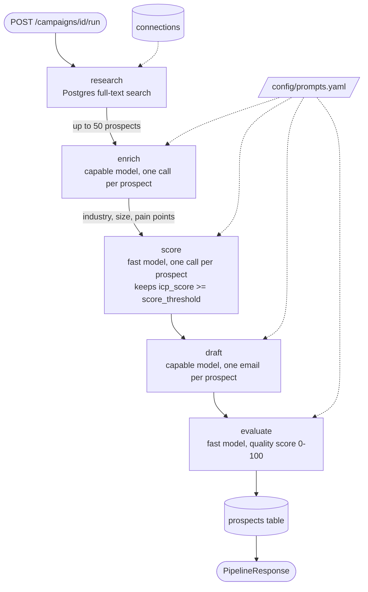

# AI Sales Intelligence

A LangGraph sales prospecting pipeline behind a FastAPI service, instrumented with
OpenTelemetry and exporting to [Base14 Scout](https://base14.io). The model calls are traced
by the official OpenTelemetry GenAI packages for the OpenAI, Anthropic and Google SDKs.

The full guide is
[LangGraph OpenTelemetry Instrumentation](https://docs.base14.io/instrument/apps/auto-instrumentation/langgraph/).
The [LLM Observability guide](https://docs.base14.io/guides/ai-observability/llm-observability/)
covers the same example from the model-call side: context, cost, scrubbing and retries.

## How to instrument LangGraph with OpenTelemetry

1. The dependencies are pinned in `pyproject.toml`: the OpenTelemetry SDK and OTLP HTTP
   exporter, the FastAPI, SQLAlchemy, httpx and logging instrumentations, and the GenAI
   instrumentations `opentelemetry-instrumentation-genai-openai`,
   `opentelemetry-instrumentation-genai-anthropic` and
   `opentelemetry-instrumentation-google-genai`.
2. `setup_telemetry(engine)` in `src/sales_intelligence/telemetry.py` runs before the FastAPI
   app is created. It registers OTLP trace and metric exporters, the span processor and
   exporter from `src/sales_intelligence/genai_spans.py`, the httpx, logging and SQLAlchemy
   instrumentors, and `instrument()` on `OpenAIInstrumentor`, `AnthropicInstrumentor` and
   `GoogleGenAiSdkInstrumentor`. `instrument_fastapi(app)` runs after the app is created.
3. Each LangGraph node is wrapped in `src/sales_intelligence/graph.py` with
   `tracer.start_as_current_span(f"invoke_agent {name}")`, because the nodes are plain
   functions and no instrumentation gives them a span.
   `opentelemetry-instrumentation-genai-langchain` is not used: for a graph of plain
   function nodes it adds one `invoke_workflow` span per run, and under `ainvoke` the work
   inside the graph does not nest under that span.
4. `OTEL_SERVICE_NAME=ai-sales-intelligence`,
   `OTEL_EXPORTER_OTLP_ENDPOINT=http://otel-collector:4318` and `OTEL_ENABLED=true` are set
   in `compose.yaml`.

The GenAI instrumentations create a `chat {model}` CLIENT span and the
`gen_ai.client.token.usage` and `gen_ai.client.operation.duration` metrics for every SDK call.
This example adds:

- The agent, the campaign, the real provider for Ollama, the cost, and PII scrubbing of
  captured content on those spans, in `src/sales_intelligence/genai_spans.py`.
- Cost, retry, fallback and error counters, in `src/sales_intelligence/llm.py`.
- `pipeline.run`, an `invoke_agent` span per node and a span per prospect or draft, in
  `graph.py` and `agents/`.
- A `retrieval prospects_fts` span around the Postgres full-text search, in
  `agents/research.py`.
- HTTP request metrics, in `src/sales_intelligence/middleware/metrics.py`.

## Agent Workflow

`POST /campaigns/{id}/run` runs a linear LangGraph pipeline of five agents over a shared
`AgentState`. There are no conditional edges. Each agent reads what the previous one wrote,
and an empty input makes an agent pass the state through unchanged.


```mermaid
flowchart TD
    req([POST /campaigns/id/run]) --> research
    research["research<br/>Postgres full-text search"] -->|up to 50 prospects| enrich
    enrich["enrich<br/>capable model, one call per prospect"] -->|industry, size, pain points| score
    score["score<br/>fast model, one call per prospect<br/>keeps icp_score >= score_threshold"] --> draft
    draft["draft<br/>capable model, one email per prospect"] --> evaluate
    evaluate["evaluate<br/>fast model, quality score 0-100"] --> save[(prospects table)]
    save --> resp([PipelineResponse])

    db[(connections)] -.-> research
    prompts[/config/prompts.yaml/] -.-> enrich & score & draft & evaluate
```

- **research** matches the campaign's keywords and titles against imported connections
  with `websearch_to_tsquery`, ranked by `ts_rank`. It makes no LLM call.
- **enrich** asks the model for each prospect's industry, company size, pain points and
  recent news, and returns them as JSON.
- **score** rates each prospect against the ideal customer profile. Prospects below
  `score_threshold` (default 50) go no further.
- **draft** writes a personalized subject and body for each prospect that passed, using
  the enrichment data and the score reasoning.
- **evaluate** scores each draft and records a `gen_ai.evaluation.result` event.
  Drafts below `quality_threshold` (default 60) are saved with `quality_passed=false`
  and are not regenerated.

## What's Instrumented

One run produces a single trace:

```text
POST /campaigns/{id}/run                 (FastAPI)
├─ SELECT                                (SQLAlchemy)
├─ pipeline.run
│  ├─ invoke_agent research
│  │  └─ retrieval prospects_fts
│  │     └─ SELECT                       (SQLAlchemy, full-text search)
│  ├─ invoke_agent enrich
│  │  └─ enrich.prospect                 (one per prospect)
│  │     └─ chat qwen3.5:9B              (OpenAI package)
│  ├─ invoke_agent score
│  │  └─ score.prospect
│  │     └─ chat qwen3.5:9B
│  ├─ invoke_agent draft
│  │  └─ draft.email
│  │     └─ chat qwen3.5:9B
│  └─ invoke_agent evaluate
│     └─ evaluate.draft                  (gen_ai.evaluation.result event)
│        └─ chat qwen3.5:9B
└─ INSERT                                (SQLAlchemy, saved prospects)
```

| Layer | Method | What You Get |
| --- | --- | --- |
| HTTP Requests | `FastAPIInstrumentor` | Request spans with method, path, status, duration |
| Database Queries | `SQLAlchemyInstrumentor` | Query spans with the SQL statement and duration |
| External HTTP | `HTTPXClientInstrumentor` | Outbound call spans for Anthropic and Gemini; the OpenAI SDK sends through `httpx2`, which it does not patch |
| Logging | `LoggingInstrumentor` | Trace and span IDs on log lines |
| LLM Calls | GenAI instrumentations | `chat {model}` spans, token and duration metrics |
| LLM Call Context | `genai_spans.py`, `llm.py` | Agent, campaign, provider and cost on chat spans; cost, retry, fallback and error counters |
| Agent Pipeline | `graph.py`, `agents/` | `pipeline.run`, `invoke_agent {name}` and per-item spans with business context |
| Evaluations | `agents/evaluate.py` | `gen_ai.evaluation.result` events and the `base14.gen_ai.evaluation.score` histogram |

### What the example adds to the instrumentations

The instrumentations are library instrumentors, called once in `telemetry.py`. They do not
know which agent made a call or which campaign it served, so the example adds:

- The agent and campaign behind a model call (`gen_ai.agent.name`, `base14.campaign_id`).
- `gen_ai.provider.name=ollama`, where the OpenAI instrumentation reports `openai` for
  Ollama's OpenAI-compatible endpoint. The token and duration metric points still say
  `openai`; only the spans are corrected.
- Cost per call, from `_shared/pricing.json` at the repository root.
- Agent and per-item spans for the graph, and retry, fallback and error counters.

The Anthropic and OpenAI clients are built with `max_retries=0`, and the Google Gen AI
client does not retry by default. The tenacity retry on each provider's `generate()` in
`llm.py` is the only retry layer, so each attempt is one `chat {model}` span.

## Quick Start

### Prerequisites

- Docker with Compose.
- [uv](https://docs.astral.sh/uv/), for the tests and for running the app on the host.
- `jq`, used by `scripts/test-api.sh`.
- [Ollama](https://ollama.com) on the host, with the model pulled:

  ```bash
  ollama pull qwen3.5:9B
  ```

  Or an API key for one of the hosted providers. To run Ollama in Compose instead, start it
  with `docker compose --profile ollama up -d`, set `OLLAMA_BASE_URL=http://ollama:11434` in
  `.env`, and pull the model inside that container.
- Base14 Scout credentials, to export to Scout: `SCOUT_CLIENT_ID`, `SCOUT_CLIENT_SECRET`,
  `SCOUT_TOKEN_URL` and `SCOUT_ENDPOINT` in `.env`. Without them the example still runs and
  prints telemetry to the collector log.

### Setup

```bash
cp .env.example .env
docker compose up -d --build
```

This starts the app on port 8000, PostgreSQL and the OpenTelemetry Collector. The defaults
use Ollama on the host, so no API key is needed.

### Run on the host

To run the app with `uv` instead of in a container, start only PostgreSQL and the collector,
then `make run`:

```bash
make dev
cp .env.example .env
docker compose up -d postgres otel-collector
make run
```

`make run` points the app at the published Postgres port `5433`, the collector on
`localhost:4318` and Ollama on `localhost:11434`, and passes `--env-file .env` to uvicorn so
that the GenAI instrumentations read `.env` too.

### Test the API

```bash
# Run the API end to end on a one-connection sample
./scripts/test-api.sh

# Or on the full sample of ten connections, up to four model calls per matching connection
CONNECTIONS_CSV=data/sample-connections.csv PIPELINE_TIMEOUT=3600 ./scripts/test-api.sh

# Check the telemetry that reached the collector
./scripts/verify-scout.sh

# Or manually:
# 1. Health check
curl http://localhost:8000/health

# 2. Create a campaign
curl -X POST http://localhost:8000/campaigns \
  -H "Content-Type: application/json" \
  -d '{"name": "Test", "target_keywords": ["AI"], "target_titles": ["CTO"]}'

# 3. Import connections (scoped to campaign)
curl -X POST http://localhost:8000/campaigns/{id}/connections/import \
  -F "file=@data/sample-connections.csv"

# 4. Run the pipeline (generates LLM traces)
curl -X POST http://localhost:8000/campaigns/{id}/run \
  -H "Content-Type: application/json" \
  -d '{"score_threshold": 50, "quality_threshold": 60}'
```

`verify-scout.sh` checks that every `chat` span comes from a GenAI instrumentation, that no
chat span names Ollama as `openai`, and the GenAI attributes and metrics.

## Configuration

### Environment Variables

The Default column shows the app's default. Where `compose.yaml` or `make run` sets a
different value, the description says so.

| Variable | Description | Default |
| --- | --- | --- |
| `LLM_PROVIDER` | Primary LLM provider (`ollama`, `anthropic`, `google`, `openai`) | `ollama` |
| `LLM_MODEL_CAPABLE` | Model for enrich and draft | `qwen3.5:9B` |
| `LLM_MODEL_FAST` | Model for score and evaluate | `qwen3.5:9B` |
| `FALLBACK_PROVIDER` | Provider used after the primary exhausts its retries; no fallback happens when it equals `LLM_PROVIDER` | `ollama` |
| `FALLBACK_MODEL` | Fallback model name | `qwen3.5:9B` |
| `OLLAMA_BASE_URL` | Ollama server URL; Compose sets `http://host.docker.internal:11434` | `http://localhost:11434` |
| `ANTHROPIC_API_KEY` | Anthropic API key | - |
| `GOOGLE_API_KEY` | Gemini API key, used when `LLM_PROVIDER=google` | - |
| `OPENAI_API_KEY` | OpenAI API key | - |
| `DEFAULT_TEMPERATURE` / `DEFAULT_MAX_TOKENS` | Passed to every model call | `0.7` / `4096` |
| `DATABASE_URL` | PostgreSQL connection string; Compose uses `postgres:5432`, `make run` uses `localhost:5433` | `postgresql+asyncpg://...` |
| `OTEL_EXPORTER_OTLP_ENDPOINT` | OpenTelemetry Collector endpoint; Compose sets `http://otel-collector:4318` | `http://localhost:4318` |
| `OTEL_SERVICE_NAME` | Service name in traces | `ai-sales-intelligence` |
| `SCOUT_ENVIRONMENT` | Deployment environment tag | `development` |
| `OTEL_ENABLED` | Enable or disable telemetry | `true` |
| `OTEL_INSTRUMENTATION_GENAI_CAPTURE_MESSAGE_CONTENT` | Prompt and completion capture: `no_content`, `span_only`, `event_only` or `span_and_event` | `no_content` |
| `LOG_LEVEL` | Root logger level | `INFO` |
| `PROMPTS_CONFIG_PATH` | Custom path to prompts.yaml | `config/prompts.yaml` |

The provider value `google` selects Gemini. Telemetry reports it as `gcp.gemini`, the semantic convention name.

### Supported Models

| Provider | Model IDs | Pricing (per 1M tokens, input/output) |
| --- | --- | --- |
| Ollama | `qwen3.5:9B` | not priced, cost 0 |
| Anthropic | `claude-sonnet-4-6`, `claude-sonnet-4-5` | $3/$15, $3/$15 |
| Gemini | `gemini-3.7-flash`, `gemini-3.1-pro-preview` | $0.75/$3.75, $2/$12 |
| OpenAI | `gpt-4.1`, `gpt-4.1-mini` | $2/$8, $0.40/$1.60 |

Prices come from `_shared/pricing.json` at the repository root, which Compose mounts into
the container. Anthropic IDs are matched to the file's dot-form keys, such as
`claude-sonnet-4.6`. A model that is not in the file costs $0.00 rather than raising an
error.

## Project Structure

```text
├── config/
│   └── prompts.yaml        # Prompts and company context
├── data/                   # Sample connection CSVs
├── scripts/
│   ├── test-api.sh         # End-to-end API run
│   └── verify-scout.sh     # Checks the telemetry in the collector log
├── src/sales_intelligence/
│   ├── agents/             # LangGraph agent nodes
│   │   ├── research.py     # PostgreSQL FTS search, retrieval span
│   │   ├── enrich.py       # LLM company inference
│   │   ├── score.py        # ICP scoring with LLM
│   │   ├── draft.py        # Email generation
│   │   └── evaluate.py     # Quality evaluation
│   ├── api/                # Campaign and connection routes
│   ├── repositories/       # Database access
│   ├── middleware/
│   │   ├── metrics.py      # HTTP request metrics
│   │   └── span_status.py  # ERROR status on 4xx and 5xx server spans
│   ├── config.py           # Pydantic settings
│   ├── errors.py           # Unhandled exception handler, failed-item spans
│   ├── database.py         # Async SQLAlchemy
│   ├── models.py           # ORM models
│   ├── state.py            # Pydantic agent state
│   ├── graph.py            # LangGraph pipeline, pipeline.run and agent spans
│   ├── genai_spans.py      # Agent, campaign, provider, cost and scrubbing on chat spans
│   ├── llm.py              # SDK clients, retries, fallback, counters
│   ├── pricing.py          # Prices from _shared/pricing.json
│   ├── pii.py              # Scrubbing patterns for captured content
│   ├── parsing.py          # JSON extraction from model output
│   ├── prompts.py          # Prompt loader from YAML
│   ├── telemetry.py        # OpenTelemetry setup
│   └── main.py             # FastAPI app
```

## Prompt Customization

All LLM prompts are in `config/prompts.yaml`.

### Company Context

Edit the `company` section to personalize generated emails:

```yaml
# config/prompts.yaml
company:
  name: "Your Company"
  product_name: "Your Product"
  value_proposition: "your unique value proposition"
  sender_name: "Jane Smith"
  sender_title: "Account Executive"
```

These values are interpolated into email drafts:

- `{company_name}` → Your Company.
- `{product_name}` → Your Product.
- `{value_proposition}` → your unique value proposition.
- `{sender_name}` → Jane Smith.
- `{sender_title}` → Account Executive.

### Prompt Templates

Each agent has `system` and `user` prompt templates:

```yaml
prompts:
  draft:
    system: |
      You are an expert B2B sales copywriter for {company_name}.
      Our product: {product_name}
      Our value proposition: {value_proposition}
      ...
    user: |
      Write a personalized cold email for this prospect:
      Name: {first_name} {last_name}
      ...
```

### Custom Config Path

Override the config location via environment variable:

```bash
PROMPTS_CONFIG_PATH=/custom/path/prompts.yaml
```

### Hot Reload (Development)

To reload prompts without restarting:

```python
from sales_intelligence.prompts import reload_config
reload_config()  # Clears cache, next call loads fresh config
```

## OpenTelemetry GenAI Conventions

The GenAI instrumentations emit the latest experimental
[OpenTelemetry GenAI Semantic Conventions](https://opentelemetry.io/docs/specs/semconv/gen-ai/).
They do not read `OTEL_SEMCONV_STABILITY_OPT_IN`.

### Span Attributes

The instrumentations set `gen_ai.operation.name`, `gen_ai.provider.name`,
`gen_ai.request.model`, `gen_ai.request.temperature`, `gen_ai.request.max_tokens`,
`gen_ai.response.model`, `gen_ai.response.id`, `gen_ai.response.finish_reasons`,
`gen_ai.usage.input_tokens`, `gen_ai.usage.output_tokens` and `server.address` on each
`chat {model}` span. `server.port` is left out when it is the default 443. The example adds
`gen_ai.agent.name`, `base14.campaign_id` and `base14.gen_ai.cost_usd`.

### Metrics

| Metric | Type | Description |
| --- | --- | --- |
| `gen_ai.client.token.usage` | Histogram | Tokens per call (input/output) |
| `gen_ai.client.operation.duration` | Histogram | LLM call duration |
| `base14.gen_ai.cost` | Counter | Cost in USD, with agent and campaign |
| `base14.gen_ai.retry.count` | Counter | Retry attempts, excluding the initial attempt |
| `base14.gen_ai.fallback.count` | Counter | Provider switches |
| `base14.gen_ai.error.count` | Counter | Errors by provider and type |
| `base14.gen_ai.evaluation.score` | Histogram | Quality scores, normalized from 0-100 to 0-1 |

### Captured Content and Events

With `span_only`, `gen_ai.input.messages`, `gen_ai.system_instructions` and
`gen_ai.output.messages` are set on the chat span. `GenAISpanExporter` scrubs emails, phone
numbers, SSNs, LinkedIn URLs and card numbers from them before export. `event_only` and
`span_and_event` send content as a `gen_ai.client.inference.operation.details` log event,
which this example does not scrub. The instrumentations read the setting once, at startup.

The evaluate agent records each score as a `gen_ai.evaluation.result` event on the
`evaluate.draft` span:

```python
span.add_event("gen_ai.evaluation.result", {
    "gen_ai.evaluation.name": "email_quality",
    "gen_ai.evaluation.score.value": 87,
    "gen_ai.evaluation.score.label": "passed",
})
```

### Error Handling

The instrumentation records a failed call's exception, sets `error.type` to the SDK's
exception class and sets status ERROR on that attempt's chat span. When an agent skips a
prospect or draft after a failure, its `enrich.prospect`, `score.prospect`, `draft.email`
or `evaluate.draft` span is marked ERROR and the pipeline goes on.

When the primary provider fails after its retries, the client switches to the fallback
provider and records a `provider_fallback` event and `gen_ai.fallback.triggered=true` on the
current per-item span, which is not marked ERROR if the fallback succeeds. With the
defaults the fallback provider equals the primary, so no switch happens; set
`FALLBACK_PROVIDER` to a different provider to see it.

Unhandled route errors are recorded on the active span by `src/sales_intelligence/errors.py`,
and HTTP server spans are marked ERROR from status 400 up.

## Development

```bash
# Run all checks (lint, typecheck, test)
make check

# Run only tests
make test

# Run integration tests (requires Docker)
make test-integration

# Format code
make format

# Security audit
make audit
```

## Troubleshooting

### No traces appearing in Scout

1. **Check the OpenTelemetry Collector is running:**

   ```bash
   docker compose ps
   curl http://localhost:4318/v1/traces  # Should return 405
   ```

2. **Check zpages:**

   ```bash
   # Open http://localhost:55679/debug/tracez
   ```

3. **Check the Scout credentials:** all four `SCOUT_*` values must be set in `.env`. The
   collector log names a missing or rejected credential.

4. **Check telemetry is enabled:** `OTEL_ENABLED` must not be `false` in `.env` or
   `compose.yaml`.

### No content on spans

Set `OTEL_INSTRUMENTATION_GENAI_CAPTURE_MESSAGE_CONTENT=span_only`. The instrumentations
accept only `no_content`, `span_only`, `event_only` and `span_and_event`, and log a warning
for any other value. On the host, run the app with `make run`, which exports `.env` to the
process.

### LLM calls failing

1. **Check Ollama is reachable:**

   ```bash
   curl http://localhost:11434/api/tags
   ```

2. **Check the API key when using a hosted provider:** the key for `LLM_PROVIDER` must
   be set in `.env`, then the app restarted with `docker compose up -d`.

3. **Check rate limits:** the client makes up to 3 attempts with exponential backoff.

### Database connection issues

1. **Check PostgreSQL is running:**

   ```bash
   docker compose ps
   docker compose logs postgres
   ```

2. **Check database connectivity:**

   ```bash
   docker compose exec postgres psql -U postgres -c "SELECT 1;"
   ```

### Token costs

Cost is 0 on Ollama, because Ollama models are not in `_shared/pricing.json`. On a hosted
provider, group `base14.gen_ai.cost` or `base14.gen_ai.cost_usd` on chat spans by
`gen_ai.agent.name` in Scout to see which agent spends the most. Enrich and draft use
`LLM_MODEL_CAPABLE`, score and evaluate use `LLM_MODEL_FAST`; set a cheaper fast model to
lower the cost of the per-prospect calls.

## References

- [OpenTelemetry GenAI Semantic Conventions](https://opentelemetry.io/docs/specs/semconv/gen-ai/).
- [OpenTelemetry GenAI instrumentation for Python](https://github.com/open-telemetry/opentelemetry-python-genai).
- [Base14 Scout Documentation](https://docs.base14.io/).
- [LangGraph Documentation](https://docs.langchain.com/oss/python/langgraph/overview).
- [FastAPI Documentation](https://fastapi.tiangolo.com/).
